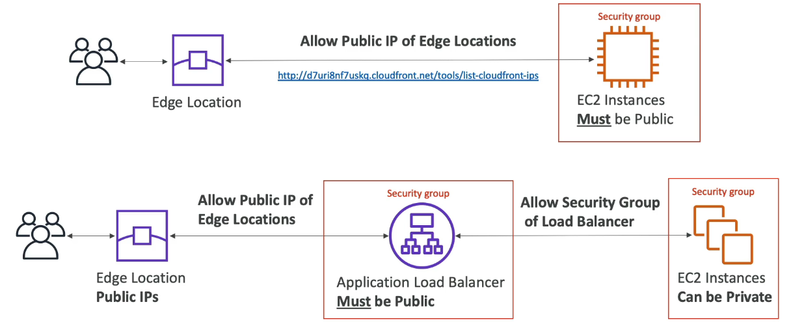

## AWS CloudFront
- Improves read performance by caching content at the edge
- Improves user experience
- 216 edge locations globally
- DDoS protection (because worldwide), integration with Shield and WAF
- General mechanism behaves like a cache:
  - Client requests to the edge location
  - CloudFront forwards request to the origin (via AWS private network)
  - Caches at the local edge (TTL)
  - Next request will come from the local cache which is faster

### CloudFront Origins
- S3: 
  - for distributing files and caching them at the edge
  - Enhanced security with CloudFront Origin Access Control (OAC to replace OAI)
  - CloudFront can be used as an ingress (upload files to S3)
- Custom Origin (HTTP)
  - ALB
  - EC2
  - S3 website (must first enable the bucket as a static S3 website)
  - Any HTTP backend

### CloudFront VS S3 Cross-Region Replication
- CloudFront
  -  Greate for static content
  -  Automatically available everywhere
-  S3 Cross-Region Replication
   -  Must be manually setup for each region
   -  Files are updated in near real-time
   -  Read-only
   -  Greate for dynamic content that needs to be available at low-latency in a few regions

### ALB/EC2 as Origin
