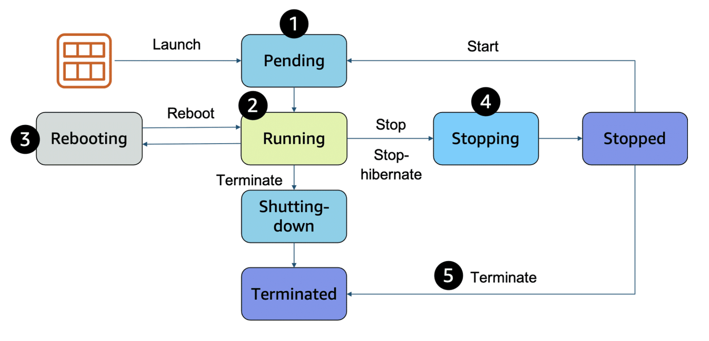

# Amazon EC2 Technical Fundamentals

<ins>**Behind the scenes**</ins>

 **AWS operates and manages the host machines and the hypervisor layer**. AWS also installs the virtual machine operating system, called the **guest operating system.**

A hypervisor is software or firmware that makes it possible to **share physical hardware resources across one or more virtual machines.**

The hypervisor provisions the resources to create and run your VMs.

<ins>**Amazon Machine Image**</ins>

- Configure which operating system to use by selecting an **Amazon Machine Image (AMI)**
- Includes the operating system, storage mapping, architecture type, laumnch permissions and any additional preinstalled software applications
- **AMI ID is region specific**
- Quick start AMIs, AWS Marketplace AMIs, Community AMIs etc

<ins>**Amazon EC2 instance types**</ins>

EC2 instances are a combination of vCPUs, memory, network, and in some cases, instance storage and graphics processing.

- Instance sizing depends on demands of application and anticipated user base
- Instance types consist of a prefix identifying the type of workloads they’re optimized for:

<ins>**EC2 Instance Locations**</ins>

- Unless otherwise specified, EC2 instances are placed in a <ins>default virtual private cloud (VPC) upon launching</ins>
- Any resource inside default VPC will be public and accessible by the internet.
- Instance resides in an Availability Zone. <ins>(scoped at the Availability Zone level)</ins>
- Architecting for high availability by using more than one instance in separate availability zones

<ins>**EC2 Instance Lifecycle**</ins>

- Pending: Billing has not started. Actions performed to set up instance, eg copying the AMI content to the root device, allocating necessary networking components

- Running: Billing begins

- Rebooting: Instance keeps its public DNS name (IPv4) and private and public IPv4 addresses.

- Stopping/Stopped:

    - When an instance stops and starts, it can be placed on a <ins>new underlying physical server, retaining its private IPv4 addresses.</ins>
    - An instance can be started and stopped if it has an Amazon EBS volume as its root device.
    - Billing for the instance stops, but storage for any Amazon EBS volumes is still charged.
    - While instance is in a stopped state, <ins>attributes of the instance can be modified (eg instance type)</ins>

- Terminate: Instance stores are erased and both public and private IP addesses of machine are lost. Stops incurring charges for that instance

<ins>**EC2 Instance Pricing**</ins>

- On demand instances (pay for compute capacity per hour or per second)
- Spot instances (applications with flexible start and end times)
- Savings plan (workloads with consistent and predictable usage)
- Reserved instances (steady-state usage that might require reserved capacity)

