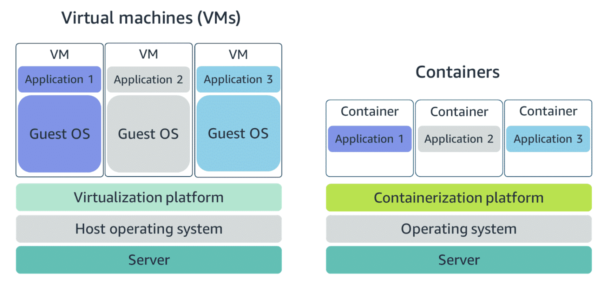
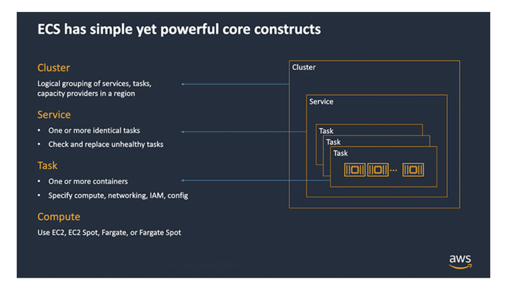
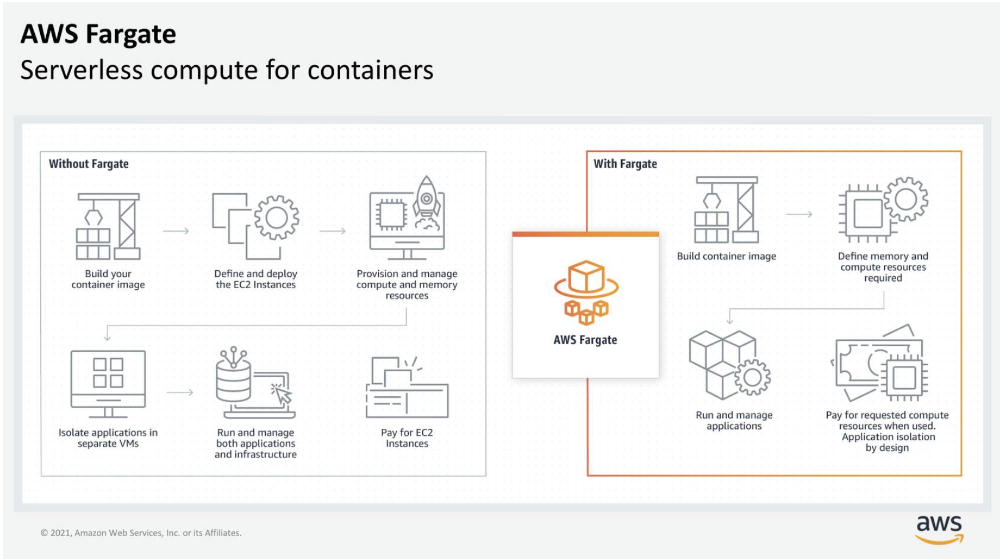

# Amazon ECS brief overview


<ins>**What are containers:**</ins>

- <ins>A standardized unit that packages code and its dependencies</ins>:
- Designed to run reliably on any platform because the container creates its own environment
- Enables workloads to be carried from one place to another (development to production)
- <ins>Docker</ins> is an example of a containerization platform





- Compared to virtual machines, <ins>**containers share the same operating system and kernel as the host that they are deployed on**</ins>
- Virtual machines contain their own operating system (Guest OS)


<ins>**Orchestraing containers using Amazon ECS**</ins>

- End-to-end container orchestration service

- <ins>Task definitions</ins>: A text file in JSON format that describes one or more containers, similar to a blue print that describes resources required to run a container <i>(eg CPU, memory, ports, images, storage and networking information)</i>

- Containers are defined in task definition that is used to <ins>run an individual task, or a task within a service</ins>

- Option to run tasks and services on <ins>serverless infrastructure managed by AWS Fargate</ins>

- Option to run tasks and services on a <ins>cluster of EC2 instances that you manage for more control</ins> <i>(requires the installation of Amazon ECS container agent on EC2 instances, responsible for communicating to ECS service about cluster management details)</i>




<ins>Example task definition json file</ins>:

```yml
{
    "family": "webserver",
    "containerDefinitions": [ {
        "name": "web",
        "image": "nginx",
        "memory": "100",
        "cpu": "99"
    } ],
    "requiresCompatibilities": [ "FARGATE" ],
    "networkMode": "awsvpc",
    "memory": "512",
    "cpu": "256"
}
```

<ins>**Exploring serverless containers with AWS Fargate**</ins>





- AWS Fargate is a purpose-built <ins>serverless compute engine for containers.</ins>

- Fargate abstracts the EC2 instance so that you’re <ins>not required to manage the underlying compute infrastructure</ins>

- Natively integrates with IAM and Amazon Virtual Private Cloud (Amazon VPC), allowing Fargate containers to be launched inside your network and control connectivity to your applications.


