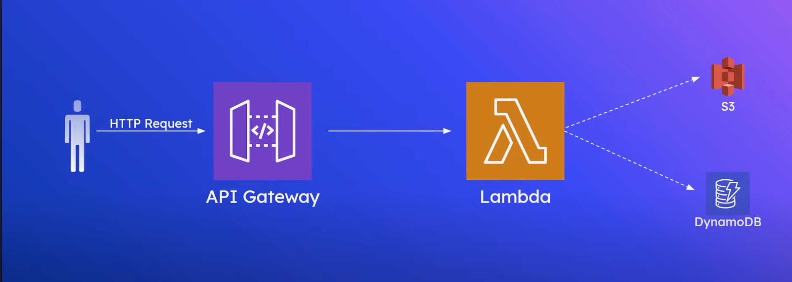
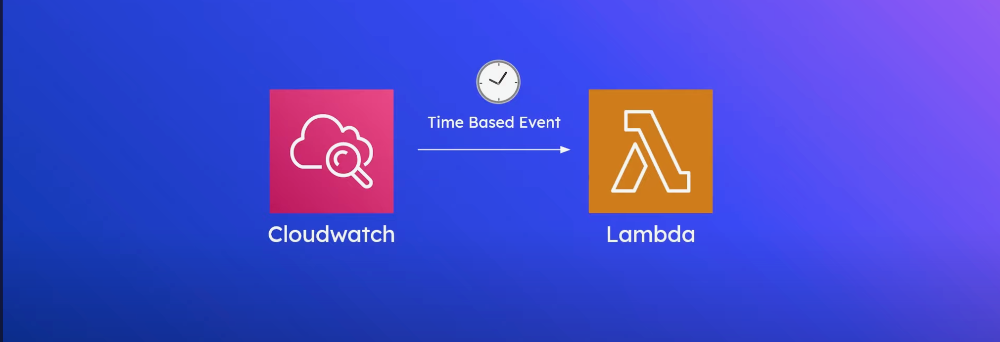
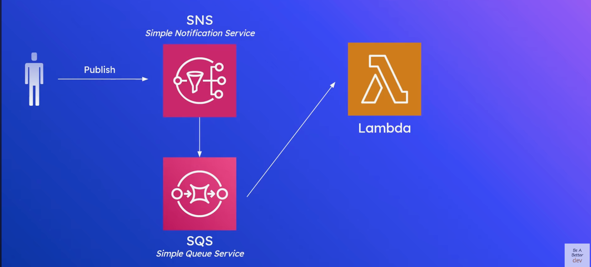
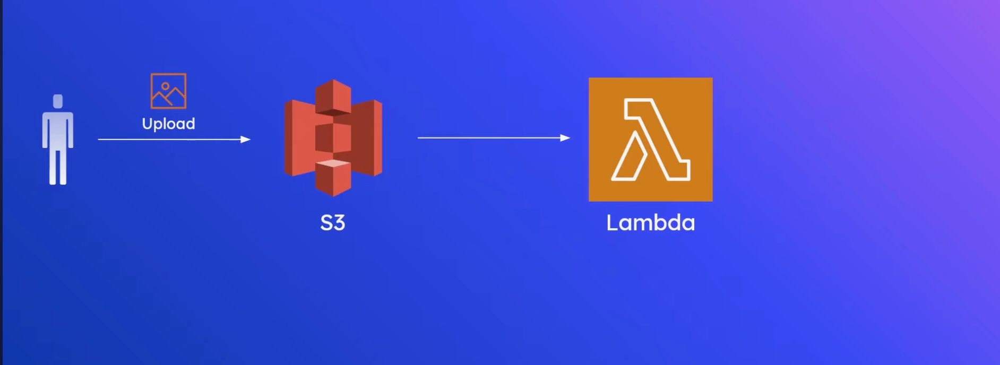
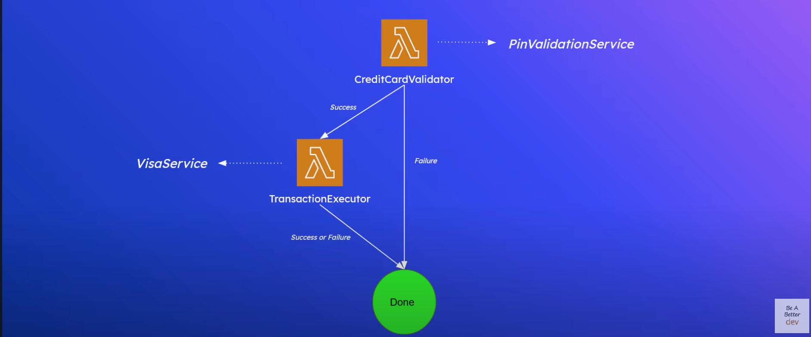
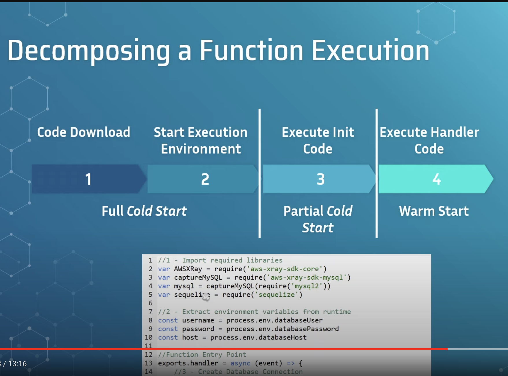
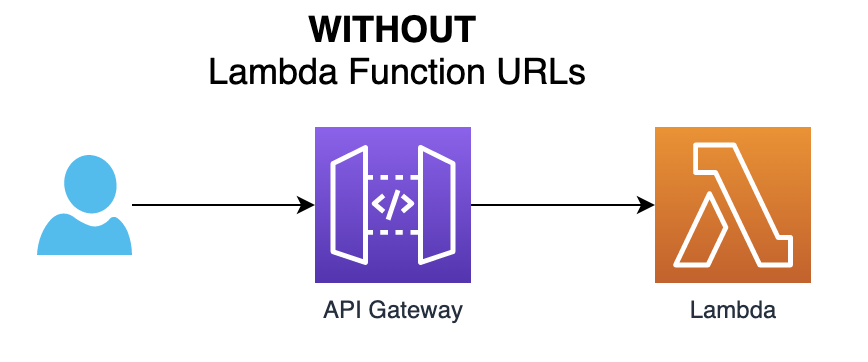
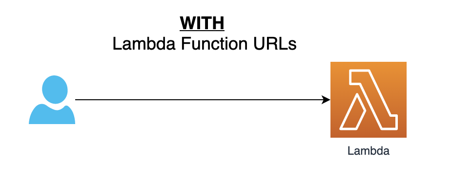
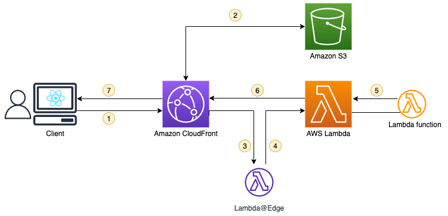
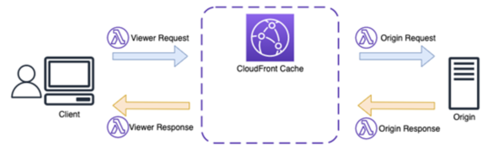

# AWS Lambda Functions

### <ins>**Overview**</ins>

- Serverless compute service
- Run code at scale without worrying about servers
- **Functions** are the primary unit of Lambda (Python functions or docker containers)
- Useful for API hosting, event processing and ad-hoc or timer based jobs
- Several popular use cases include:

    1. [<ins>**API Gateway Integration and Function URLs**</ins>](#api-gateway-integration-and-function-urls): Expose Lambda Functions to clients (mobile applications/web server) by building HTTP and REST endpoints via API Gateway or Function URLs 
    - 

    2. <ins>**Serverless CRON Jobs**</ins>: Set up a time-based event to invoke on a regular interval (eg nightly database maintenance, dashboard updating)
    - 

    3. <ins>**Event processing with SNS/SQS**</ins>: Publishes to SNS topic, SNS then delivers message to queue, and Lambda Function pulls message from queue for processing 
    - 
    
    4. <ins>**File Upload Processing with S3**</ins>: Whenever an upload to S3 bucket occurs, it automatically invokes the Lambda Function with the filename as the input 
    - 

    5. <ins>**Logic for Step Function Workflows**</ins>: To build complex sequential or parallel workflows that comprise of multiple lambda functions (branching logic, retries, exception handling etc) 
    - 

**Advantages**:
- No servers to manage 
- Autoscaling
- Pay for what you use (per invocation)
- Service integrations (S3, DynamoDB, SQS)
- Ease of use for quick delivery

**Disadvantages**:
- Loses low level control and visibility over infrastructure
- Lambda cold starts (no active lambda containers to handle requests) [Strategies to minimize cold starts](#strategies-to-minimize-cold-starts)

------------------------------------------------------------------------------------------------------------------------------------------------

### <ins>**Lambda concepts**</ins>

1. <ins>Function:</ins> Lambda runs instances of your function to process events (from scratch, blueprint, or container image)

2. <ins>Trigger:</ins> Integrates Lambda function with other AWS services and event source mappings so that function runs in response to certain API calls or by reading items from a stream or queue

3. <ins>Event:</ins> JSON-formatted document that contains data for a Lambda function to process.

4. <ins>Deployment Package:</ins> Methods to deploy function code (zip file archive or container image)

5. <ins>Runtime:</ins> Provides a language-specific environment that runs in an application environment

6. <ins>Lambda Function Handler:</ins> Method in your function code that processes events

7. <ins>Application Environment:</ins> Manages the processes and resources that are required to run the function

------------------------------------------------------------------------------------------------------------------------------------------------

### <ins>**Lambda Function Execution**</ins>

1. Code download (.zip file, .jar downloaded from in S3, container in ECR)
2. Starting execution environment (depends on programming language)
3. Executing initialization code (eg import statements)
4. Executing handler code (actual function logic)

<ins>**Cold starts also occur while scaling up: Lambda will scale up by up to 500 environments (containers) per minute**</ins>

#### Strategies to minimize cold starts:

1. Minimize number of library dependencies
2. Only import what is required (avoid 'import *')
3. Raise memory configuration of lambda function
4. Utilize provisioned concurrency (having a certain number of lambda containers always available to handle traffic, but will incur additional costs)

------------------------------------------------------------------------------------------------------------------------------------------------

### API Gateway Integration and Function URLs

<ins>**Function URLs**</ins>: Allow invocation of lambda functions from a HTTPS endpoint, exposing functions to applications outside of AWS with a HTTP client. Good for setting up HTTP URLs quickly without the need to set up an API Gateway endpoint

<ins>**Authentication types**</ins> for the invoking the lambda function via a function URL:
- **None**: Makes the URL publicly accessible from anywhere on the Internet. <ins>**Useful for testing but should be avoided for production**</ins>
-  **AWS_IAM**: Defines access to function URL by defining a Resource Based Policy to allow AWS Principals (Roles, Users, Organizations) to invoke the function.

<ins>**Features offered by API Gateway**</ins>:
- Throttling: Preventing clients from calling API beyond a certain point
- IP whitelisting/blacklisting
- Authorization through Amazon Cognito
- Request validation

<ins>**Key notes**</ins>:
- No additional cost is incurred when using Function URLs beyond the invocation cost, but integration with API Gateway costs extra

- API Gateway timeout is set to a **maximum of 30 seconds and cannot be adjusted**

------------------------------------------------------------------------------------------------------------------------------------------------

### <ins>**Protecting a Lambda Function URL with Amazon CloudFront and Lambda@Edge**</ins>:

- <ins>Function URL is configured with AWS_IAM</ins> authentication type so that only authenticated users/roles can invoke it

- <ins>CloudFront (Content Delivery Network (CDN) service) in front of Lambda URL</ins> adds a layer of security and potentially cache content closer to users

- Lambda function at the edge: CloudFront has ability to run Lambda functions closer to users <ins>(Lambda@Edge)</ins>
    - <ins>Signs the request</ins> made to the Lambda Function URL
    - <ins>Adds the appropriate headers</ins> to the request so that invocation is authenticated with IAM
    - [Lambda Edge Trigger Events](#lambda-edge-trigger-events)

<ins>**Request flow**</ins>

1. The user performs requests via the client to reach static assets or a Lambda function URLs.

2. For a static asset, CloudFront retrieves it from S3 or its cache and returns it to the client.

3. Else, the request first goes to a Lambda@Edge. The Lambda@Edge function has the <ins>lambda:InvokeFunctionUrl</ins> permission on the target Lambda function URL and uses this to sign the request with the signature V4. It adds the Authorization, X-Amz-Security-Token, and X-Amz-Date headers to the request.

4. After the request is properly signed, CloudFront forwards it to the Lambda function URL.

5. Lambda triggers the execution of the function that performs any kind of business logic.

6. Lambda returns the response of the function to CloudFront.

7. Finally, CloudFront returns the response to the client.

#### Lambda Edge Trigger Events

- _Viewer request_: After CloudFront receives a request from the client.

- _Origin request_: Before the request is forwarded to the origin. (This is the event that is used to update the request before it is sent to the Lambda function URL)

- _Origin response_: After CloudFront receives the response from the origin.

- _Viewer response_: Before the response is sent back to the client.

