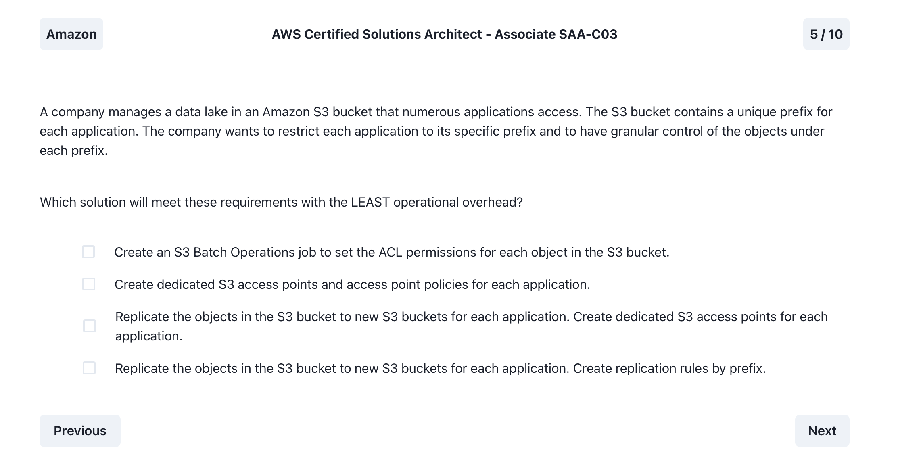

# Exam Prepper Questions

## Question: 1.png

Click to reveal the correct answer

- 2) Use the Trusted Advisor recommendations in the management account
- 5) Review the Trusted Advisor checks for Amazon RDS Reserved Instance Optimization

Notes:

- 

## Question: 2.png

Click to reveal the correct answer

- 1) Host the visualization tool in the same AWS Region as the data warehouse and access it over a Direct Connect conncetion at a location in the same Region

Notes:

- 

## Question: 3.jpeg

Click to reveal the correct answer

- Implement a target tracking action triggered at a lower CPU threshold, and decrease the cooldown period

Notes:

- Target Tracking Scaling Policy: With a target tracking scaling policy, you can set a target value for a specific metric, such as CPU utilization. The Auto Scaling group then adjusts the capacity to maintain that target.

- Lower CPU Threshold: By triggering the target tracking action at a lower CPU threshold, the Auto Scaling group can proactively add instances when the workload increases, helping to address the slowness at the beginning of the day.

- Decrease Cooldown Period: Reducing the cooldown period allows the Auto Scaling group to scale in and out more rapidly, making adjustments quicker in response to changing demand.

## Question: 4.png

Click to reveal the correct answer

- Configure AWS WAF

Notes:

- WAF helps with layer 7 attacks like SQL injection and Cross-Site Scripting. Shield is helpful for DDOS attacks.

## Question: 5.jpeg

Click to reveal the correct answer

- Request strongly consistent reads for the table

Notes:

- DynamoDB by default provides eventual consistency for read operations, which means that a query may not reflect the most recent data changes immediately after an update. Instead, it may take some time for the data to propagate across all replicas in the DynamoDB global table.

- To ensure that read operations return the latest data and address the issue of stale data being returned to users, the solutions architect should recommend switching the read consistency level from eventually consistent reads to strongly consistent reads.

## Question: 6.jpeg

Click to reveal the correct answer

- Add a resource-based policy to the function with lambda:InvokeFunction as the action and Service: events.amazonaws.com as the principal

Notes:

- 

## Question: 7.png

Click to reveal the correct answer

- Configure an Amazon SNS dead letter queue that has an Amazon Simple Queue Service (Amazon SQS) target with a retention period of 14 days

Notes:

- A dead-letter queue is an Amazon SQS queue that an Amazon SNS subscription can target for messages that can't be delivered to subscribers successfully

- The goal is to retain undeliverable messages for analysis (NOT to deliver them), and this is typically achieved with a dead letter queue.

## Question: 8.png

Click to reveal the correct answer

- 3. Turn on the sticky sessions feature (session affinity on the ALB)
- 5. Deploy an Amazon ElastiCache for Redis cluster to store customer session information

Notes:

- 

## Question: 9.jpeg

Click to reveal the correct answer

- Configure a warm standby Amazon RDS for SQL Server database on AWS. Configure AWS Database Migration Service (AWS DMS) to use change data capture (CDC)

Notes:

- Backup & Restore (RPO in hours, RTO in 24 hours or less)
- Pilot Light (RPO in minutes, RTO in hours)
- Warm Standby (RPO in seconds, RTO in minutes) *** Right Answer ***
- Active-Active (RPO is none or possibly seconds, RTO in seconds)

## Question: 10.png

Click to reveal the correct answer

- Use a Multi-AZ deployment of an Amazon RDS for MySQL DB instance with a General Purpose SSD (gp2) EBS volume

Notes:

- 

## Question: 11.jpeg

Click to reveal the correct answer

- Update the Amazon Cognito identity pool to assume the proper IAM role for access to the protected content

Notes:

- Amazon Cognito identity pools are designed to work with IAM roles. When a user authenticates, the identity pool can assume an IAM role on behalf of the user, granting them the permissions associated with that role.

## Question: 12.png

Click to reveal the correct answer

- Create an IAM policy that grants least privilege permission. Attach the policy to the IAM groups

Notes:

- IAM roles are not directly attached to IAM groups.

## Question: 13.png

Click to reveal the correct answer

- Configure an Amazon API Gateway endpoint in front of an Amazon Kinesis Data Firehose that stores the information that the company receives in an Amazon S3 bucket. Use an API Gateway Lambda authorizer to resolve authorization

Notes:

- 

## Question: 14.png

Click to reveal the correct answer

- Create a predictive scaling policy for the Auto Scaling group. Configure the policy to scale based on forecast. Set the scaling metric to CPU utilization. Set the target value for the metric to 60%. In the policy, set the instances to pre-launch 30 minutes before the jobs run.

Notes:

- The scheduled scaling policy, while close, doesn't leverage the predictive capabilities that can better handle varying transaction loads.

- 

## Question: 15.jpeg

Click to reveal the correct answer

- Create an Amazon S3 File Gateway. Update the business system to use a new network share from the S3 File Gateway

Notes:

- 

## Question: 16.jpeg

Click to reveal the correct answer

- Configure each development environment with its own Amazon Aurora On-Demand PostgreSQL Compatible database

Notes:

- 

## Question: 17.png

Click to reveal the correct answer

- Send the requests from API Gateway REST API to an Amazon Simple Notification Service (Amazon SNS) topic. Subscribe Amazon Simple Queue Service (Amazon SQS) queues to the SNS topic. Configure the target Lambda functions to poll the different SQS queues.

Notes:

- SNS has message filtering

## Question: 18.jpeg

Click to reveal the correct answer

- Enable Default Host Configuration Management in Systems Manager to manage the EC2 instances

Notes:

- 

## Question: 19.png

Click to reveal the correct answer

- Create an On-Demand Capacity Reservation that specifies the Region and three Availability Zones needed

Notes:

- 

## Question: 20.png

Click to reveal the correct answer

- Search CloudTrail logs with Amazon Athena queries to identify the errors

Notes:

- 

## Question: 21.png

Click to reveal the correct answer

- Publish VPC fow logs to Amazon CloudWatch Logs. Create required metric filters. Create an Amazon CloudWatch metric alarm with a notification action for when the alarm is in the ALARM state

Notes:

- 

## Question: 22.png

Click to reveal the correct answer

- Use Amazon RDS deployed in a Multi-AZ instance deployment to create an Amazon Aurora database. Direct the reporting functions to the reader instances

Notes:

- Multi-AZ DB clusters aren't available with the following engines:
    - RDS for MariaDB
    - RDS for Oracle
    - RDS for SQL Server

## Question: 23.jpeg

Click to reveal the correct answer

- Create a backup plan by using AWS Backup to perform nightly backups. Copy the backups to another Region. Add the application's EC2 instances as resources

Notes:

- By adding the EC2 instances as resources, it ensures that both the instance configuration and all attached EBS volumes are included in the backup

## Question: 24.png

Click to reveal the correct answer

- Remove the two NAT instances and replace them with two NAT gateways in different Availability Zones

Notes:

- **NAT gateways are AWS managed**, and automatically scale to accommodate increases in network traffic without manual intervention

- NAT instances require manual management and updates

## Question: 25.png

Click to reveal the correct answer

- Encrypt a copy of the latest DB snapshot. Replace exiting DB instance by restoring the encrypted snapshot

Notes:

- 

## Question: 26.png

Click to reveal the correct answer

- Use Amazon Cognito for authentication. Use Lambda@Edge for authorization. Use Amazon CloudFront to serve the web application globally.

Notes:

- 

## Question: 27.png

Click to reveal the correct answer

- Configure provisioned concurrency for the Lambda functions. Increase the memory according to AWS Compute Optimizer recommendations

Notes:

- **Provisioned concurrency keeps functions initialized** and ready to respond immediately, which helps maintain low latency for customers during high-concurrency events. **It eliminates cold starts** and ensures consistent performance

## Question: 28.png

Click to reveal the correct answer

- Use Amazon Compute Optimizer to generate EBS volume recommendations for optimization

Notes:

- 

## Question: 29.png

Click to reveal the correct answer

- Store the images in Amazon S3 buckets. Use Amazon DynamoDB with the geographic code as the key and the image S3 URL as the value

Notes:

- 

## Question: 30.jpeg

Click to reveal the correct answer

- Order multiple AWS Snowball devices that have Tape Gateway. Copy the physical tapes to virtual tapes in Snowball. Ship the Snowball devices to AWS. Create a lifecycle policy to move the tapes to Amazon S3 Glacier Deep Archive

Notes:

- 

## Question: 31.jpeg

Click to reveal the correct answer

- Use server-side encryption with customer managed AWS KMS keys

Notes:

- 

## Question: 32.png

Click to reveal the correct answer

- 2,4,6

Notes:

- ALB >>HTTPS>> WEB tier >>HTTPS>> Application >>SQL traffic>> SQL DB

## Question: 33.jpeg

Click to reveal the correct answer

- Create an Auto Scaling group that has a minimum of one and a maximum of one. Create an Amazon Machine Image (AMI) of each application instance. Use the AMI to create EC2 instances in the Auto Scaling group Configure an Application Load Balancer in front of the Auto Scaling group.

Notes:

- 

## Question: 34.png

Click to reveal the correct answer

- Use AWS Systems Manager Run Command to run a custom command that applies the patch to all EC2 instances

Notes:

- 

## Question: 35.png

Click to reveal the correct answer

- Create interface endpoints for Amazon S3. Use the interface endpoints to securely access the data from the Region and on-premises location

Notes:

- 

## Question: 36.jpeg

Click to reveal the correct answer

- Retain the latest Amazon Machine Images (AMIs) of the web and application tiers. Enable automated backups in Amazon RDS and use point-in-time recover to meet the RPO

Notes:

- If there is no temporary local storage on the EC2 instances, then snapshots of EBS volumes are not necessary. Therefore, if your application does not require temporary storage on EC2 instances, using AMIs to back up the web and application tiers is sufficient to restore the system after a failure.

- Snapshots of EBS volumes would be necessary if you want to back up the entire EC2 instance, including any applications and temporary data stored on the EBS volumes attached to the instances. When you take a snapshot of an EBS volume, it backs up the entire contents of that volume. This ensures that you can restore the entire EC2 instance to a specific point in time more quickly.

## Question: 37.png

Click to reveal the correct answer

- Enable detailed monitoring on all EC2 instances. Use Amazon CloudWatch metrics to perform further analysis.

Notes:

- Enabling detailed monitoring on EC2 instances provides metrics at a 1-minute granularity, which is well within the required 2-minute granularity for performance analysis.

## Question: 38.jpeg

Click to reveal the correct answer

- Host the visualization tool in the same AWS Region as the data warehouse and access it over a Direct Connect connection at a location in the same Region.

Notes:

- 

## Question: 39.png

Click to reveal the correct answer

- Configure an ECS capacity provider with Fargate for steady state and Fargate Spot for burst traffic

Notes:

- 

## Question: 40.png

Click to reveal the correct answer

- Create an Aurora read replica of the RDS for PostgreSQL DB instance. Promote the Aurora read replicate to a new Aurora PostgreSQL DB cluster

Notes:

- 

## Question: 41.png

Click to reveal the correct answer

- Update the Amazon Cognito identity pool to assume the proper IAM role for access to the protected content

Notes:

- 

## Question: 42.png

Click to reveal the correct answer

- Create dedicated S3 access points and access point policies for each application

Notes:

- S3 Access Points: These provide a way to manage access to shared data sets in Amazon S3. Each access point has a unique hostname and a policy that is specific to the use case, **allowing for granular control over access to data.**

## Question: 43.png

Click to reveal the correct answer

- Create a new AWS Key Management Service (AWS KMS) customer managed key to encrypt both the S3 bucket and the RDS for MySQL database. Ensure that the KMS key policy includes encrypot and decrypt permissions for the ECS task execution role.

Notes:

- 

## Question: 44.png

Click to reveal the correct answer

- Create a presigned URL for the template object. Configure the CloudFormation stack to use the presigned URL

Notes:

- 

## Question: 45.jpeg

Click to reveal the correct answer

- Configure S3 Cross-Region Replication from the company's S3 bucket to one of the marketing firm's S3 Buckets

Notes:

- 

## Question: 46.jpeg

Click to reveal the correct answer

- Use Amazon API Gateway and direct transactions to the AWS Lambda functions as the application layer. Use Amazon Simple Queue Service (Amazon SQS) as the communication layer between the application services

Notes:

- 

## Question: 47.png

Click to reveal the correct answer

- Allow the Lambda execution role in the AWS KMS key policy
- Add AWS KMS permissions in the Lambda execution role

Notes:

- 

## Question: 48.png

Click to reveal the correct answer

- Share the dashboard from the CloudWatch console. Enter the product manager's email address, and complete the sharing steps. Provide a sharable link for the dashboard to the product manager

Notes:

- CloudWatch allows you to share a dashboard using a shareable URL that can be accessed without requiring AWS credentials

## Question: 49.png

Click to reveal the correct answer

- Upload and store content in Amazon S3. Use S3 Transfer Acceleration for the uploads

Notes:

- 

## Question: 50.png

Click to reveal the correct answer

- Provision an internet-facing Application Load Balancer (ALB) in a public subnet. Ass the EC2 instance to the target group that is associated with the ALB. Ensure that the DNS record for the website resolved to the ALB

Notes:

- 

