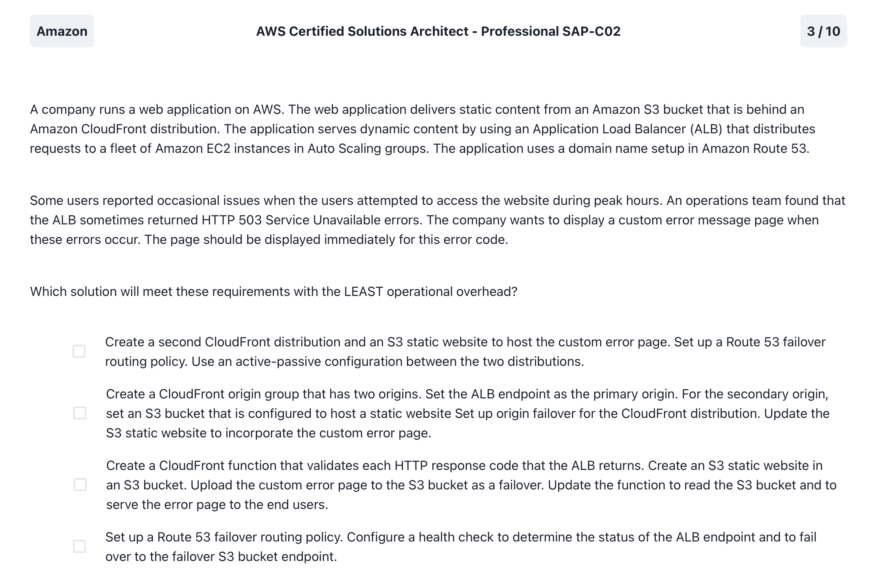
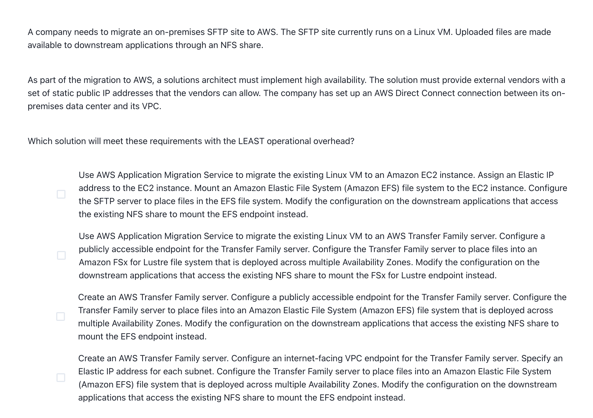

# Exam Prepper Questions

## Question: 1.png

Click to reveal the correct answer

- Create an AWS Global Accelerator standard accelerator. Specify the ALB as the accelerator's endpoint. Provide the accelerator's IP addresses to the customer

Notes:

- **Global Accelerator provides two global static public IPs** that act as a fixed entry point to your application endpoints, such as Application Load Balancers, Network Load Balancers, Amazon Elastic Compute Cloud (EC2) instances, and elastic IPs.

## Question: 2.png

Click to reveal the correct answer

- Create a CloudFront origin group that has two origins. Set the ALB endpoint as the primary origin. For the secondary origin, set an S3 bucket that is configured to host a static website. Set up origin failover for the CloudFront distribution. Update the S3 static website to incorporate the custom error page.

Notes:

- 

## Question: 3.png

Click to reveal the correct answer

- Create a separate service in the ECS cluster for the waiting room. Use a separate scaling configuration. Create a CloudFront function that inspects the JWT information and appropriately forwards requests to the ticketing service or the waiting room service.

Notes:

- 

## Question: 4.png

Click to reveal the correct answer

- Create an AWS Transfer Family server. Configure an internet-facing VPC endpoint for the Transfer Family server. Specify an Elastic IP address for each subnet. COnfigure the Transfer Family server to place files into an Amazon Elastic File System (Amazon EFS) file system that is deployed across multiple Availability Zones. Modify the configuration on the downstream applications that access the existing NFS share to mount the EFS endpoint instead.

Notes:

- AWS Transfer Family eliminates SFTP server management

## Question: 5.png

Click to reveal the correct answer

- AWS Migration Hub, AWS Application Discovery Service, AWS Cloud Adoption Readiness Tool (CART)

Notes:

- AWS Application Discovery Service helps gather information about on-premises data centers to plan migrations to AWS.
- Helps understand existing infrastructure, identifies dependencies between applications and estimate AWS costs

