# Exam Topic Questions

## Question: 1.png

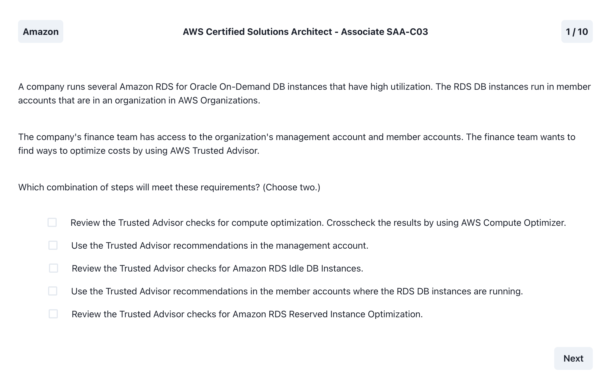

Click to reveal the correct answer

- 2) Use the Trusted Advisor recommendations in the management account
- 5) Review the Trusted Advisor checks for Amazon RDS Reserved Instance Optimization

Notes:

- 

## Question: 2.png

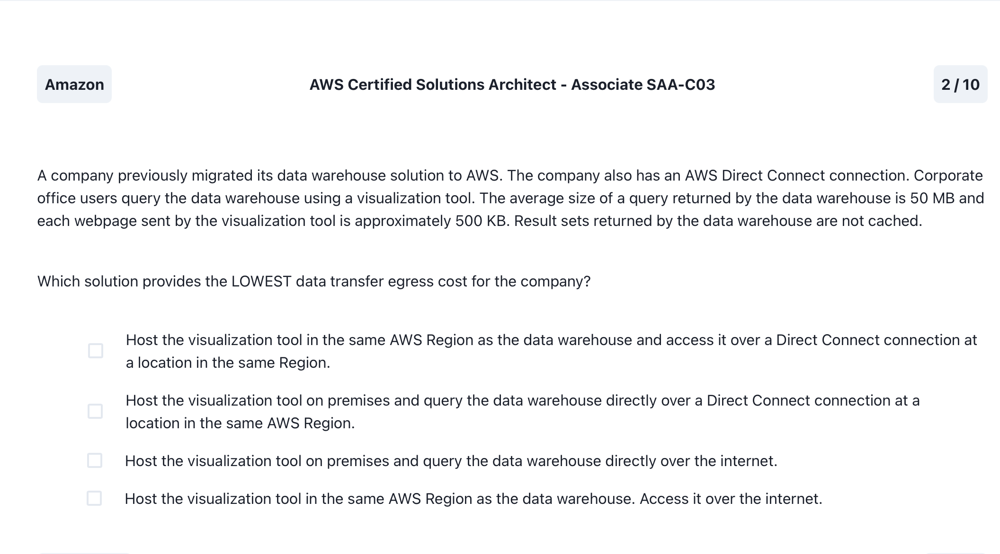

Click to reveal the correct answer

- 1) Host the visualization tool in the same AWS Region as the data warehouse and access it over a Direct Connect conncetion at a location in the same Region

Notes:

- 

## Question: 3.jpeg

Click to reveal the correct answer

- Implement a target tracking action triggered at a lower CPU threshold, and decrease the cooldown period

Notes:

- Target Tracking Scaling Policy: With a target tracking scaling policy, you can set a target value for a specific metric, such as CPU utilization. The Auto Scaling group then adjusts the capacity to maintain that target.

- Lower CPU Threshold: By triggering the target tracking action at a lower CPU threshold, the Auto Scaling group can proactively add instances when the workload increases, helping to address the slowness at the beginning of the day.

- Decrease Cooldown Period: Reducing the cooldown period allows the Auto Scaling group to scale in and out more rapidly, making adjustments quicker in response to changing demand.

## Question: 4.png

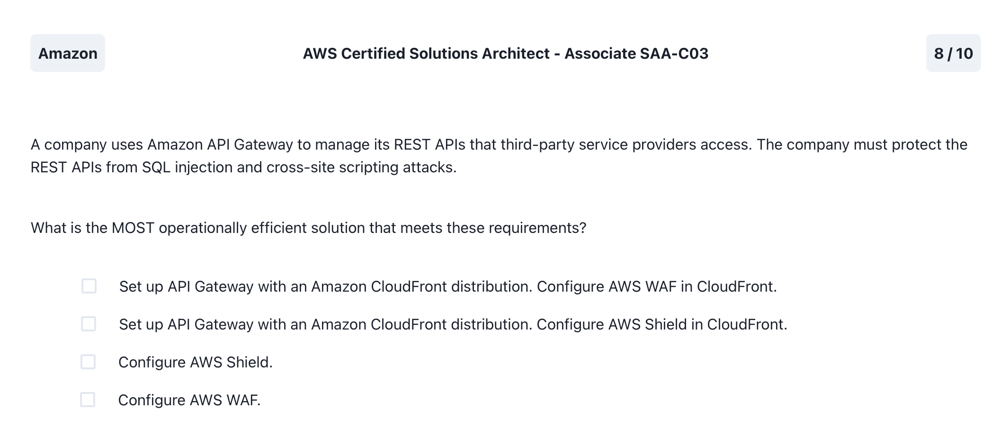

Click to reveal the correct answer

- Configure AWS WAF

Notes:

- WAF helps with layer 7 attacks like SQL injection and Cross-Site Scripting. Shield is helpful for DDOS attacks.

## Question: 5.jpeg

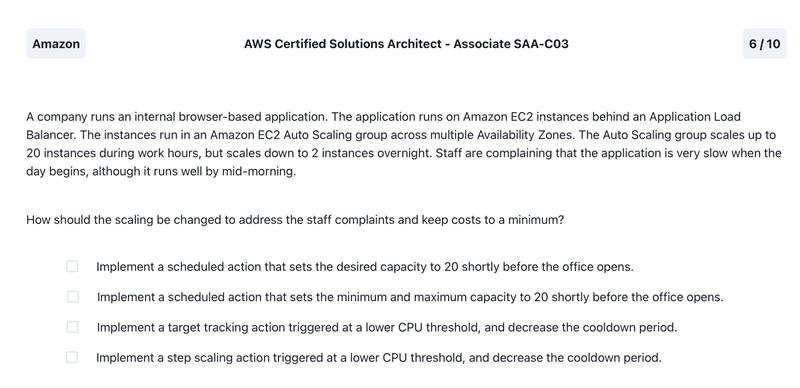

Click to reveal the correct answer

- Request strongly consistent reads for the table

Notes:

- DynamoDB by default provides eventual consistency for read operations, which means that a query may not reflect the most recent data changes immediately after an update. Instead, it may take some time for the data to propagate across all replicas in the DynamoDB global table.

- To ensure that read operations return the latest data and address the issue of stale data being returned to users, the solutions architect should recommend switching the read consistency level from eventually consistent reads to strongly consistent reads.

## Question: 6.jpeg

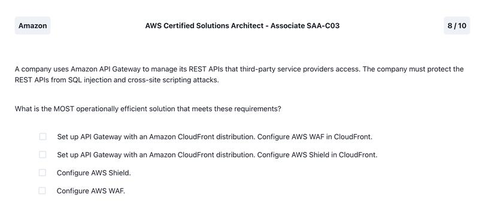

Click to reveal the correct answer

- Add a resource-based policy to the function with lambda:InvokeFunction as the action and Service: events.amazonaws.com as the principal

Notes:

- 

## Question: 7.png

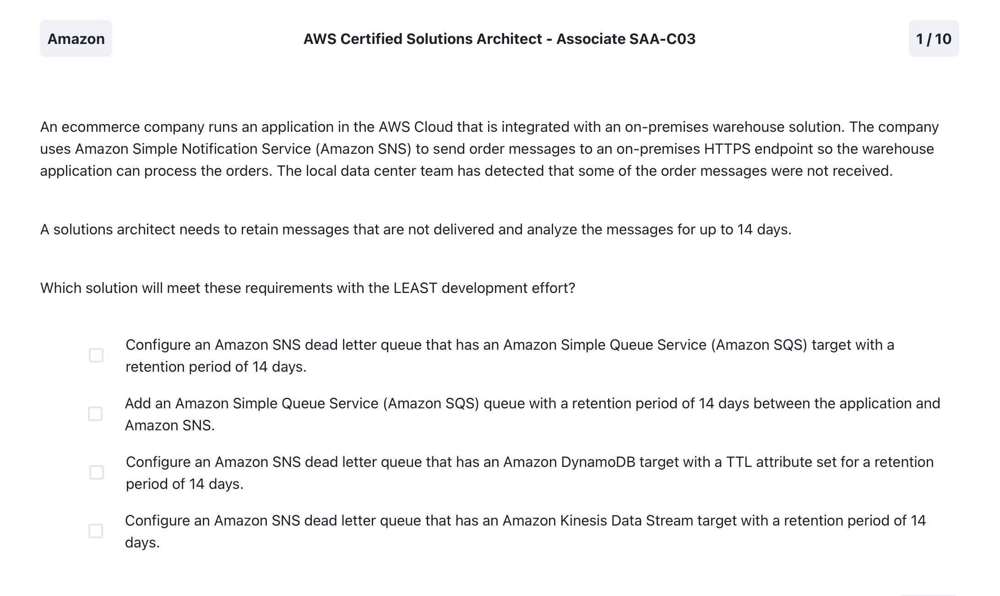

Click to reveal the correct answer

- Configure an Amazon SNS dead letter queue that has an Amazon Simple Queue Service (Amazon SQS) target with a retention period of 14 days

Notes:

- A dead-letter queue is an Amazon SQS queue that an Amazon SNS subscription can target for messages that can't be delivered to subscribers successfully

- The goal is to retain undeliverable messages for analysis (NOT to deliver them), and this is typically achieved with a dead letter queue.

## Question: 8.png

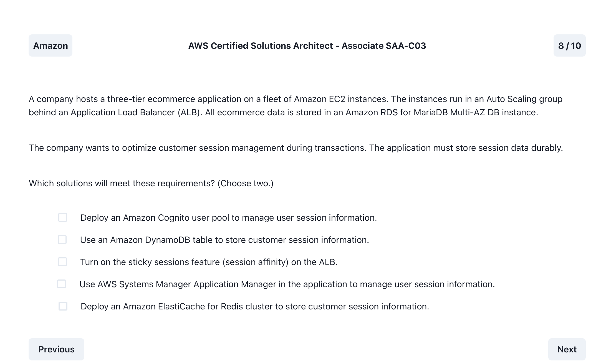

Click to reveal the correct answer

- 3. Turn on the sticky sessions feature (session affinity on the ALB)
- 5. Deploy an Amazon ElastiCache for Redis cluster to store customer session information

Notes:

- 

## Question: 9.jpeg

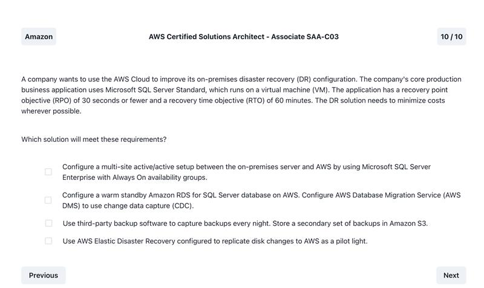

Click to reveal the correct answer

- Configure a warm standby Amazon RDS for SQL Server database on AWS. Configure AWS Database Migration Service (AWS DMS) to use change data capture (CDC)

Notes:

- Backup & Restore (RPO in hours, RTO in 24 hours or less)
- Pilot Light (RPO in minutes, RTO in hours)
- Warm Standby (RPO in seconds, RTO in minutes) *** Right Answer ***
- Active-Active (RPO is none or possibly seconds, RTO in seconds)

## Question: 10.png

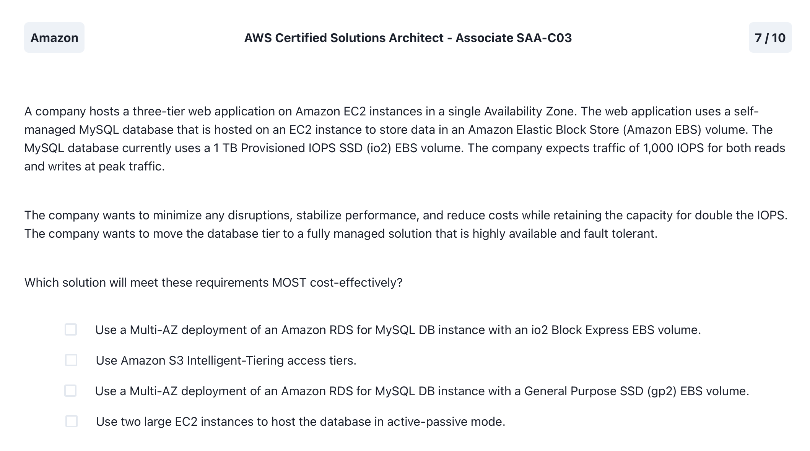

Click to reveal the correct answer

- Use a Multi-AZ deployment of an Amazon RDS for MySQL DB instance with a General Purpose SSD (gp2) EBS volume

Notes:

- 

## Question: 11.jpeg

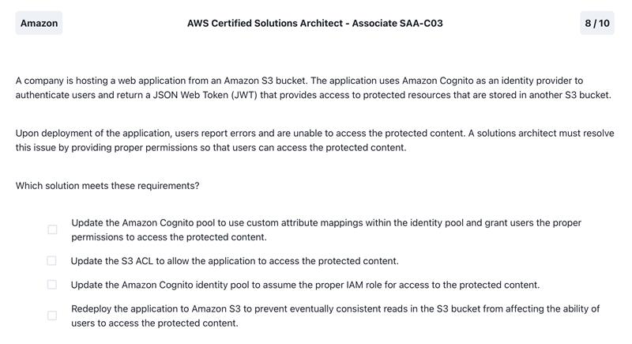

Click to reveal the correct answer

- Update the Amazon Cognito identity pool to assume the proper IAM role for access to the protected content

Notes:

- Amazon Cognito identity pools are designed to work with IAM roles. When a user authenticates, the identity pool can assume an IAM role on behalf of the user, granting them the permissions associated with that role.

## Question: 12.png

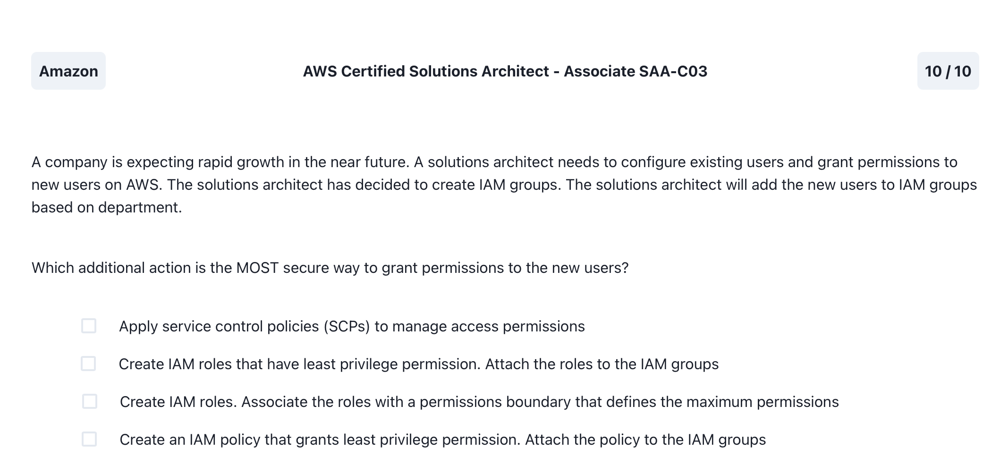

Click to reveal the correct answer

- Create an IAM policy that grants least privilege permission. Attach the policy to the IAM groups

Notes:

- IAM roles are not directly attached to IAM groups.

## Question: 13.png

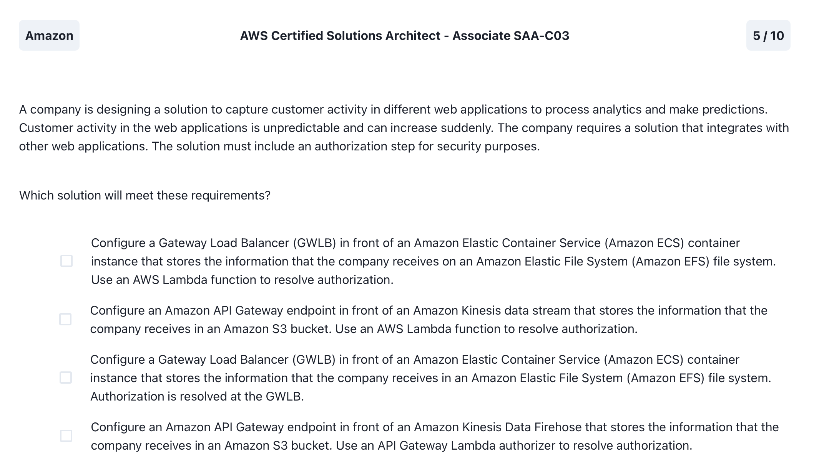

Click to reveal the correct answer

- Configure an Amazon API Gateway endpoint in front of an Amazon Kinesis Data Firehose that stores the information that the company receives in an Amazon S3 bucket. Use an API Gateway Lambda authorizer to resolve authorization

Notes:

- 

## Question: 14.png

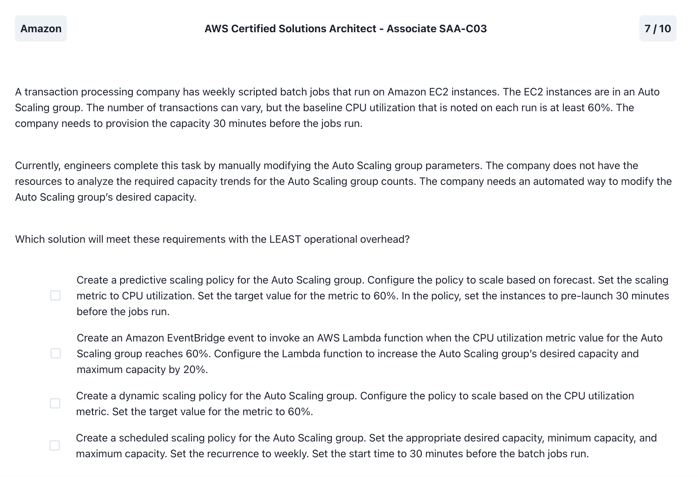

Click to reveal the correct answer

- Create a predictive scaling policy for the Auto Scaling group. Configure the policy to scale based on forecast. Set the scaling metric to CPU utilization. Set the target value for the metric to 60%. In the policy, set the instances to pre-launch 30 minutes before the jobs run.

Notes:

- 

## Question: 15.jpeg

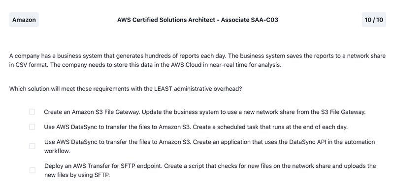

Click to reveal the correct answer

- Create an Amazon S3 File Gateway.Update the business system to use a new network share from the S3 File Gateway

Notes:

- 

## Question: 16.jpeg

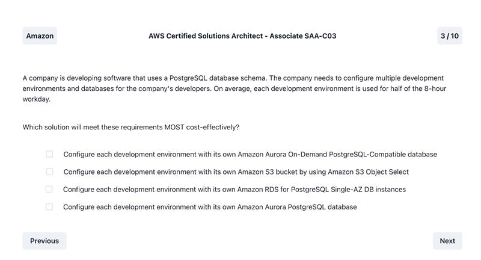

Click to reveal the correct answer

- Configure each development environment with its own Amazon Aurora On-Demand PostgreSQL Compatible database

Notes:

- 

## Question: 17.png

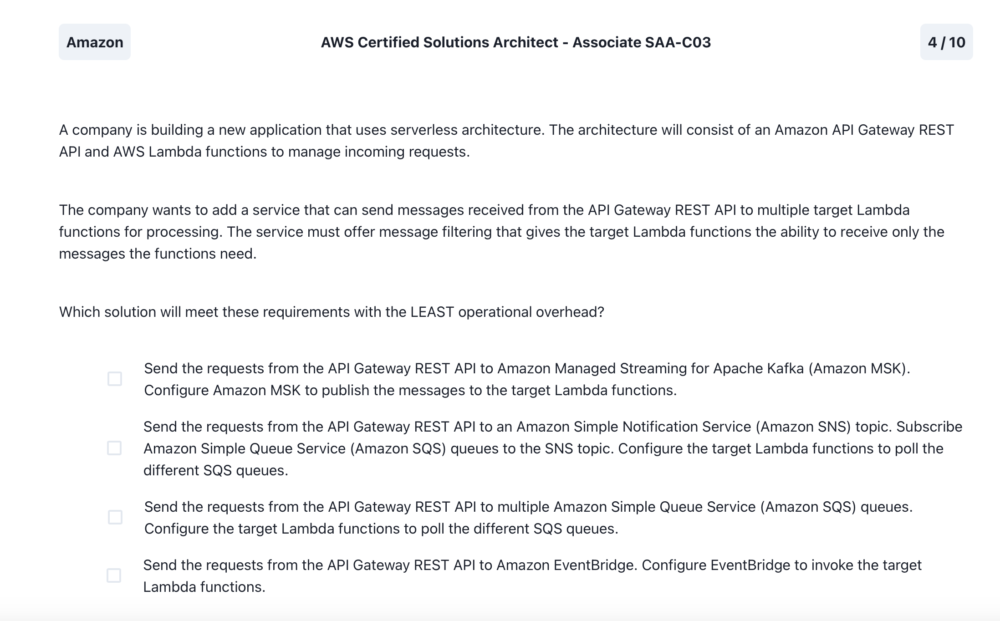

Click to reveal the correct answer

- Send the requests from API Gateway REST API to an Amazon Simple Notification Service (Amazon SNS) topic. Subscribe Amazon Simple Queue Service (Amazon SQS) queues to the SNS topic. Configure the target Lambda functions to poll the different SQS queues.

Notes:

- SNS has message filtering

## Question: 18.jpeg

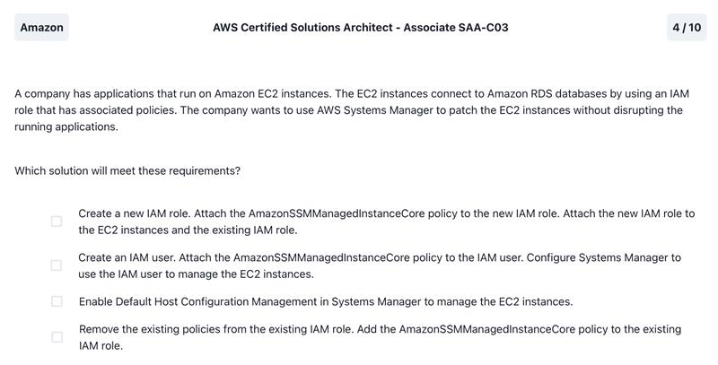

Click to reveal the correct answer

- Enable Default Host Configuration Management in Systems Manager to manage the EC2 instances

Notes:

- 

## Question: 19.png

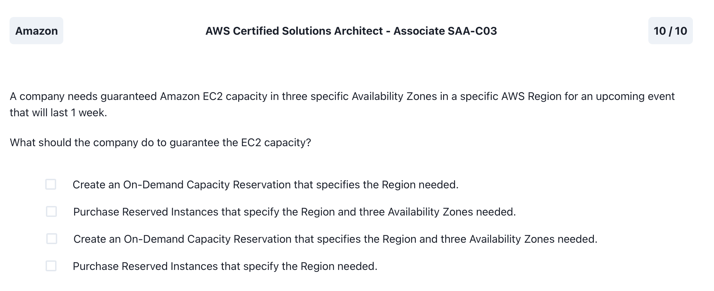

Click to reveal the correct answer

- Create an On-Demand Capacity Reservation that specifies the Region and three Availability Zones needed

Notes:

- 

