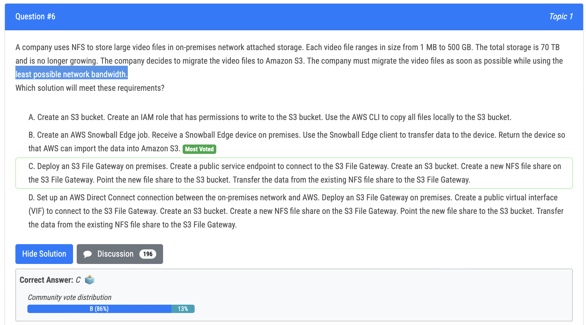
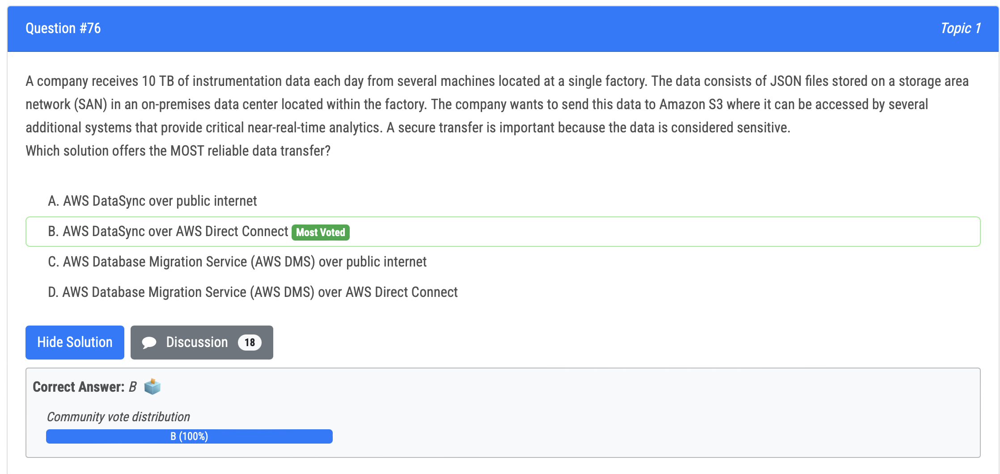
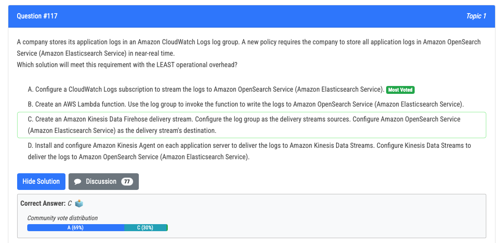
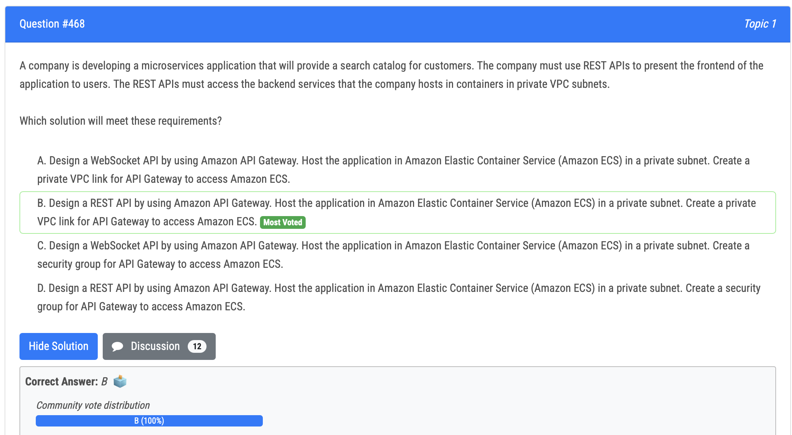

# Exam Topic Questions

## Question: 5.png

### Notes:

- Amazon EFS (Elastic File System) provides a shared, elastic file storage that can be accessed by multiple EC2 instances simultaneously. 

- All EC2 instances will have access to the same set of documents, ensuring that users see all their documents regardless of which instance they are routed to by the load balancer

## Question: 6.png

### Notes:

- 

## Question: 12.png

### Notes:

- CloudFront can cache static content from the S3 bucket at edge locations, reducing latency for static data.

- For dynamic content, CloudFront can route requests to the ALB, which then forwards them to the EC2 instances.

## Question: 19.png

### Notes:

- Gateway Load Balancer (GWLB) is specifically designed for integrating third-party virtual appliances, such as firewalls, into your VPC architecture.

## Question: 20.png

### Notes:

- Fast Snapshot Restore: This feature significantly reduces the time needed to create volumes from snapshots, which addresses the requirement to minimize the time required for cloning.

## Question: 24.png

### Notes:

- 

## Question: 25.jpeg

### Notes:

- 

## Question: 27.png

### Notes:

- https://docs.aws.amazon.com/AmazonCloudWatch/latest/monitoring/cloudwatch-dashboard-sharing.html  
- Share a single dashboard and designate specific email addresses of the people who can view the dashboard. Each of these users creates their own password that they must enter to view the dashboard.

## Question: 29.jpeg

### Notes:

- Global Accelerator has automatic failover 
- CloudFront is designed to handle HTTP protocol meanwhile Global Accelerator is best used for both HTTP and non-HTTP protocols such as TCP and UDP. 
- Amazon Application Load Balancer: Ideal for load balancing HTTP and HTTPS traffic
- Amazon Network Load Balancer: Ideal for load balancing TCP and UDP traffic

## Question: 30.png

### Notes:

- Still pay for storage when an RDS database is stopped -> Not A

## Question: 39.png

### Notes:

- Provisioned IOPS SSD: This storage type is designed to deliver fast, predictable, and consistent I/O performance, which is crucial for databases with high transaction rates and frequent updates.

- Option C (changing the DB instance to a burstable performance instance class) is suitable for workloads with varying usage patterns and burstable performance needs, but it may not provide consistent and predictable performance for heavy write workloads.

## Question: 41.png

### Notes:

- Amazon AppFlow is a fully managed integration service that helps you securely transfer data between software as a service (SaaS) applications such as Salesforce, SAP, Google Analytics, Facebook Ads, and ServiceNow, and AWS services such as Amazon Simple Storage Service (S3) and Amazon Redshift in just a few clicks. 

## Question: 47.jpeg

### Notes:

- With an On-Demand Capacity Reservation, you can specify the Region and Availability Zones where you want to reserve capacity, and the number of EC2 instances you want to reserve. This allows you to guarantee capacity in specific Availability Zones in a specific Region.

- Reserved instances are for long term

## Question: 60.png

### Notes:

- ALB listener rules allow you to redirect traffic from one listener port (e.g. 80 for HTTP) to another (e.g. 443 for HTTPS). This achieves the goal to forward all requests over HTTPS.
- Network ACLs control traffic at the subnet level and cannot distinguish between HTTP and HTTPS requests to implement a redirect (option A incorrect). 
- Replacing HTTP with HTTPS in the URL happens at the client side. It does not redirect at the ALB (option B incorrect).

## Question: 67.png

### Notes:

- The visibility timeout determines the amount of time that a message received from an SQS queue is hidden from other consumers while the message is being processed. 

- If the processing of a message takes longer than the visibility timeout, the message will become visible to other consumers and may be processed again. 

## Question: 68.png

### Notes:

- Direct Connect provides a dedicated, private network connection from on-premises to AWS, offering consistent low latency.

- Backup solution: The VPN connection serves as a backup if the primary Direct Connect fails. This meets the requirement of accepting slower traffic in case of primary connection failure.

## Question: 73.png

### Notes:

- on-prem -----> bastion host (we use internet, means that we need external IPs of the company) 
- bastion host -----> private subnet (we use private IP since we are in the same VPC, as bastion can communicate to EC2 via its private IP address)

## Question: 76.png

### Notes:

- DMS is for databases, while the question refers to JSON files

## Question: 79.png

### Notes:

- Provisioned capacity is recommended for known patterns. On-demand mode is recommended for unpredictable application traffic

## Question: 83.png

### Notes:

- Keeps backend in the US: CloudFront can use the existing on-premises servers in the United States as the origin, satisfying the requirement that the site's backend must remain in the US.

## Question: 93.png

### Notes:

- Aurora cloning is especially useful for quickly setting up test environments using your production data, without risking data corruption

## Question: 95.png

### Notes:

- 

## Question: 98.png

### Notes:

- By increasing the visibility timeout to a value greater than the total of the function timeout and the batch window timeout, we ensure that the message remains invisible long enough for the Lambda function to complete its processing. This prevents duplicate processing of the same message.

- FIFO queues guarantee that messages are processed in the exact order they are sent.

## Question: 101.png

### Notes:

- NAT gateways allow private instances to initiate outbound traffic to the Internet but do not allow inbound traffic from the Internet to reach the private instances.
- NAT gateways must be created in public subnets
- NAT gateways are availability zone specific, if you need HA you will need a NAT gateway in each availability zone.

## Question: 104.png

### Notes:

- 

## Question: 107.png

### Notes:

- Integration with analytics: Lambda functions can be designed to store the data in a format that's easily consumable by the company's existing analytics platform.

## Question: 108.png

### Notes:

- RDS Event Notifications: This allows you to capture database changes efficiently.

- Amazon SNS Topic: This provides a pub/sub messaging service that can fan out to multiple endpoints.

- Multiple SQS Queues: Each target system can have its own queue, allowing for decoupled and independent processing.

- Options A and B are less suitable because they don't provide the fan-out capability to multiple targets as efficiently.

## Question: 109.png

### Notes:

- The Object Lock legal hold operation enables you to place a legal hold on an object version.
- A legal hold prevents an object version from being overwritten or deleted. 
- However, a legal hold doesn't have an associated retention period and remains in effect until removed.

## Question: 117.png

### Notes:

- You can configure a CloudWatch Logs log group to stream data it receives to your Amazon OpenSearch Service cluster in NEAR REAL-TIME through a CloudWatch Logs subscription

## Question: 119.png

### Notes:

- 

## Question: 120.png

### Notes:

- 

## Question: 121.png

### Notes:

- You can enable encryption for an Amazon RDS DB instance when you create it, but not after it's created. 
- However, you can add encryption to an unencrypted DB instance by creating a snapshot of your DB instance, and then creating an encrypted copy of that snapshot. 
- You can then restore a DB instance from the encrypted snapshot to get an encrypted copy of your original DB instance

## Question: 124.png

### Notes:

- 

## Question: 125.png

### Notes:

- NAT gateways must be created in public subnets
- NAT gateways are availability zone specific, if you need HA you will need a NAT gateway in each availability zone.

## Question: 127.png

### Notes:

- 

## Question: 128.png

### Notes:

- Containers: The company wants to run applications in containers, which EKS supports natively.
- Stateless applications: The applications are stateless and can tolerate disruptions, making them ideal candidates for Spot Instances.
- Spot Instances offer significant cost savings compared to On-Demand Instances, often up to 90% cheaper.

## Question: 131.png

### Notes:

- An OAI provides secure access between CloudFront and S3 without exposing the S3 bucket publicly.
- The OAI is associated with the CloudFront distribution.
- The S3 bucket policy limits access only to that OAI.

## Question: 132.png

### Notes:

- Historical reports imply static content

## Question: 133.png

### Notes:

- Maintain access to the underlying OS: RDS Custom provides access to the underlying operating system, which is a specific requirement mentioned in the question.

## Question: 134.png

### Notes:

- Server-side encryption with SSE-S3: This provides encryption with the least operational overhead. SSE-S3 is fully managed by AWS, requiring no key management from the user.

- Amazon Athena: This is a serverless query service that can directly analyze data in S3, which aligns with the company's desire for a serverless solution and the need to analyze data using SQL.

## Question: 135.png

### Notes:

- AWS PrivateLink provides private connectivity between VPCs, AWS services, and your on-premises networks, without exposing your traffic to the public internet
- Option A VPC peering connection may not meet security requirement as it can allow communication between all resources in both VPCs.
- Option C, creating a NAT gateway in a public subnet of the company’s VPC can expose the target service to the internet, which would not meet the security requirements.

## Question: 138.jpeg

### Notes:

- Migrating to Amazon MQ reduces the overhead on the queue management. Amazon MQ provides a managed, highly available RabbitMQ cluster

## Question: 139.jpeg

### Notes:

- S3 event notifications can only send to SNS, SQS and lambda, but not to Sagemaker. Eventbridge can send to Sagemaker

## Question: 140.png

### Notes:

- 

## Question: 141.png

### Notes:

- Caching: CloudFront can cache both static and dynamic content, reducing the load on your origin and improving response times.

## Question: 142.png

### Notes:

- Among the given options, only Network Load Balancer (NLB) supports UDP traffic. Application Load Balancer (ALB) and API Gateway do not support UDP.

- Global Accelerator provides static IP addresses that act as a fixed entry point to your application endpoints. This meets the requirement for static IP addresses for entry into the application.

- Since the application runs on a modified Linux kernel, it needs to run on EC2 instances rather than serverless options like Lambda.

- A and B: Lambda doesn't support custom Linux kernels, and Application Load Balancer doesn't support UDP.

- D: API Gateway and Application Load Balancer don't support UDP traffic.

## Question: 145.png

### Notes:

- Auto Scaling: Using an Auto Scaling group allows the application to scale seamlessly based on demand, addressing the performance degradation and 5xx errors during busy times.

- Database Migration: Moving the database to Amazon Aurora MySQL provides better performance and scalability compared to a single EC2 instance running MySQL.

- Spot Fleet: Using Spot Instances in the Auto Scaling group can significantly reduce costs compared to On-Demand Instances, making this the most cost-effective option.

## Question: 150.png

### Notes:

- By creating composite alarms in CloudWatch, the solutions architect can combine multiple metrics, such as CPU utilization and read IOPS, into a single alarm. This allows the company to take action only when both conditions are met, reducing false alarms and focusing on meaningful alerts.

## Question: 152.png

### Notes:

- 

## Question: 154.png

### Notes:

- Governance mode: Only users with special permissions can overwrite, delete, or alter object lock settings

- Compliance mode: No user, including the root user in an AWS account, can overwrite, delete, or alter object lock settings

## Question: 157.jpeg

### Notes:

- The maximum retention period for automated backups configured directly in Amazon Aurora is 35 days.

- AWS Backup can be used to extend the backup retention beyond the 35-day limit of Aurora's native automated backups. It allows you to store backups for up to 5 years, which meets the company's requirement.

## Question: 158.jpeg

### Notes:

- 

## Question: 165.jpeg

### Notes:

- 

## Question: 168.png

### Notes:

- 

## Question: 172.png

### Notes:

- With Amazon CloudFront, you can enforce secure end-to-end connections to origin servers by using HTTPS. Field-level encryption adds an additional layer of security that lets you protect specific data throughout system processing so that only certain applications can see it.

## Question: 175.png

### Notes:

- Many applications, including those built on modern serverless architectures, can have a large number of open connections to the database server and may open and close database connections at a high rate, exhausting database memory and compute resources. 

- Amazon RDS Proxy allows applications to pool and share connections established with the database, improving database efficiency and application scalability.

## Question: 178.png

### Notes:

- 

## Question: 183.jpeg

### Notes:

- DynamoDB with on-demand capacity automatically scales read and write capacity to accommodate traffic spikes without the need for manual intervention.

- Aurora requires more management than DynamoDB and may not scale as quickly for write operations.

## Question: 184.jpeg

### Notes:

- To access private resources, the Lambda function needs to be configured to run within your VPC.

- Once in your VPC, the Lambda function can use the existing Direct Connect connection to reach the on-premises data center.

## Question: 188.jpeg

### Notes:

- SFTP support: AWS Transfer Family natively supports SFTP, which is the required protocol for the new partner.

## Question: 190.png

### Notes:

- Easy feature testing: With Elastic Beanstalk, you can create multiple environments (e.g., production, staging, development). The URL swapping feature allows you to easily switch between these environments, facilitating frequent testing of new site features.

## Question: 193.png

### Notes:

- Reduces database reads: By storing frequently accessed data in Redis, the application can retrieve this data from the cache instead of querying the RDS databases, thus reducing the number of database reads.

- Add Amazon RDS read replicas: While this could help distribute read operations, it doesn't reduce the total number of database reads. It just spreads them across more instances.

## Question: 194.png

### Notes:

- C: While this provides high availability across regions, it's typically more complex and expensive than necessary. Cross-region replication often has higher latency and doesn't provide automatic failover without additional configuration.

- Automatic Failover: Configuring the EC2 instances as a cluster with database replication allows for automatic failover if one instance or AZ experiences issues.

## Question: 199.png

### Notes:

- Multiple speaker recognition: Amazon Transcribe offers a feature called speaker diarization, which can identify and label different speakers in an audio file. This meets the requirement for multiple speaker recognition.

## Question: 201.png

### Notes:

- SMS Messaging: Amazon Pinpoint is designed for customer engagement and supports sending SMS messages at scale. It's ideal for marketing communications and can handle both outbound and inbound SMS.

## Question: 202.png

### Notes:

- Server-side encryption: SSE-S3 provides automatic encryption of data at rest in S3 buckets.

- Automatic key rotation: With SSE-S3, AWS automatically handles key management and rotation. The keys are rotated on a regular basis, which meets the requirement of annual key rotation.

## Question: 207.png

### Notes:

- 

## Question: 208.png

### Notes:

- Security groups cannot be attached to gateway VPC endpoints

## Question: 213.png

### Notes:

- 

## Question: 215.png

### Notes:

- Transferring 700 TB over a 500 Mbps connection would take longer than the 1-month requirement.

- Snowball can transfer 700 TB within the 1-month timeframe.

- S3 Glacier Deep Archive is the most cost-effective storage for long-term, infrequently accessed data.

## Question: 217.png

### Notes:

- Allowing for up to 30 minutes of downtime (active-passive failover)

- Minimizing potential data loss (Aurora Replica)

- Not requiring the solution to handle the full load during normal operations (active-passive setup)

## Question: 219.png

### Notes:

- R5 instances are memory-optimized, which is suitable for the stateful, in-memory tasks required by the application.

- However, CloudWatch doesn't provide built-in memory metrics for EC2 instances.

- The CloudWatch agent can collect custom metrics, including memory usage and application latency, which are not available as built-in metrics.

## Question: 222.png

### Notes:

- IAM roles for cross-account access, which is a standard and secure method for allowing access between AWS accounts.

- Not C: IAM users and groups are confined to a single AWS account. You can't add users from other AWS accounts to your IAM groups.

## Question: 224.png

### Notes:

- Multivalue answer routing allows you to configure Amazon Route 53 to return multiple values, such as IP addresses for your web servers, in response to DNS queries.

- Having two instances in each AZ ensures that the application can handle the load even if one instance or an entire AZ fails.

## Question: 225.png

### Notes:

- 

## Question: 226.png

### Notes:

- 

## Question: 235.png

### Notes:

- AWS Schema Conversion Tool (SCT): This is necessary to convert the schema from Oracle to PostgreSQL, as these are different database engines.

- AWS Database Migration Service (AWS DMS): This service is ideal for migrating databases to AWS, especially when you need to keep the source and target databases in sync during migration.

- Table mapping to select all tables: Since the applications write to the same tables and the data must be kept in sync across both databases, it's important to include all tables in the migration.

## Question: 237.png

### Notes:

- You can create a VPC peering connection between your own VPCs, or with a VPC in another AWS account. Peering within the same AZ is free of charge.

## Question: 239.png

### Notes:

- 

## Question: 402.png

### Notes:

- By default, Kinesis Data Streams has a data retention period of 24 hours. This means that if data is not consumed within 24 hours, it will be lost.

- Since the application is only consuming data every 48 hours (every other day), some data is likely being lost before it can be processed and written to S3.

## Question: 414.png

### Notes:

- 

## Question: 417.png

### Notes:

- Compute Savings Plan is more flexible than an EC2 Instance Savings Plan, as it covers both EC2 and Lambda usage.

## Question: 420.png

### Notes:

- Multi-AZ DB instance deployments don't provide readable standby instances. The secondary instance in a Multi-AZ pair is not accessible for reads during normal operations.

- Multi-AZ DB clusters come with up to two readable standby instances in addition to the writer instance. The reader endpoint automatically load-balances connections across all available read replicas, effectively offloading reads from the primary instance.

- By using the built-in read replicas in a Multi-AZ DB cluster, the company can offload reads without the need to create and manage separate read replicas, which would incur additional costs.

## Question: 426.png

### Notes:

- 

## Question: 427.png

### Notes:

- 

## Question: 430.png

### Notes:

-  Glacier is the most cost-effective option, and plans for using .csv files are known weeks in advance.

## Question: 431.png

### Notes:

- Redis can handle high concurrency and is designed for fast read and write operations, which is crucial for a multiplayer online game.

- Redis supports persistence, allowing you to save the state of the data. This meets the requirement of being able to stop and restore the game while preserving current scores.

## Question: 434.png

### Notes:

- DynamoDB global tables provide automatic, multi-region replication. This ensures that the data is already present and up-to-date in the disaster recovery region, eliminating data transfer time during failover.

- Auto Scaling group and load balancer in the disaster recovery Region: This ensures that the EC2 infrastructure is already set up and ready to handle traffic in the disaster recovery region.

## Question: 440.png

### Notes:

- Aurora is compatible with MySQL, and AWS provides a direct migration path from RDS MySQL snapshots to Aurora.

- The mysqldump utility creates a logical backup of the database. Aurora supports importing data from S3, including mysqldump files.

## Question: 443.png

### Notes:

- 

## Question: 447.png

### Notes:

- Application Load Balancer is regional, not global. It can't route traffic across multiple Regions, which is a key requirement for this scenario.

- Route 53 is a global service that can route traffic across multiple AWS Regions

- Route 53 health checks can monitor the availability of the application in each Region. This ensures that traffic is only routed to healthy endpoints.

- Active-Active Failover: This configuration allows traffic to be distributed across all healthy endpoints. If one Region fails, Route 53 will automatically route all traffic to the remaining healthy Regions.

## Question: 448.png

### Notes:

- Currently, there's only one VPN connection through a single customer gateway device. This is a single point of failure.
Adding a second set of VPNs from a second customer gateway device provides redundancy for the connection between the Management VPC and the data center.

- The VPC peering connection between Management and Production VPCs is already highly available by design. AWS manages the underlying infrastructure for VPC peering, so adding a second peering connection (option D) wouldn't provide additional redundancy.

## Question: 450.jpeg

### Notes:

- 

## Question: 452.png

### Notes:

- The 1 GB memory requirement fits within Lambda's capabilities.

- The minimum billable duration for Fargate tasks is 1 minute, which is more than the 10-second job duration.

## Question: 454.png

### Notes:

- Workload Discovery on AWS not only lists resources but also maps the relationships between them, which is a key requirement mentioned in the question.

## Question: 455.jpeg

### Notes:

- Budgets are created and managed through the Billing dashboard, not the Cost and Usage Reports section.

- Cost and Usage Reports is not where budgets are set up.

## Question: 465.png

### Notes:

- 

## Question: 468.png

### Notes:

- A VPC link is a resource in Amazon API Gateway that allows for connecting API routes to private resources inside a VPC.

## Question: 470.png

### Notes:

- An egress-only internet gateway (EIGW) is specifically designed for IPv6-only VPCs and provides outbound IPv6 internet access while blocking inbound IPv6 traffic.
- An egress-only internet gateway is for use with IPv6 traffic only. To enable outbound-only internet communication over IPv4, use a NAT gateway instead.

## Question: 474.png

### Notes:

- VPC peering: While this works, it would require setting up and managing individual peering connections between each pair of VPCs, which becomes complex and hard to manage at scale.

- Single Region Management: Within a single Region, Transit Gateway can easily connect all VPCs, reducing the complexity of managing multiple individual connections.

- Transit Gateway Peering: This feature allows you to connect Transit Gateways across different AWS Regions, enabling communication between VPCs in different Regions with minimal configuration.

## Question: 475.png

### Notes:

- Amazon EFS provides a fully managed, scalable, and shared file system that can be accessed by multiple EC2 instances and ECS containers simultaneously.

## Question: 476.png

### Notes:

- 

## Question: 491.png

### Notes:

- Standard queues are cheaper than FIFO queues and still meet the at-least-once processing requirement.

- The correct permissions (kms:Decrypt) are specified for the Lambda execution role.

## Question: 496.png

### Notes:

- AWS Storage Gateway is a hybrid cloud storage service that provides on-premises applications with seamless access to cloud storage. It acts as a bridge between on-premises environments and AWS cloud storage services.

- File Gateway provides a seamless way to connect on-premises applications to cloud storage.
- File Gateway provides local caching for frequently accessed data, meeting the high-performance requirement.

- Volume Gateway provides block storage volumes that can be mounted as iSCSI devices by on-premises applications.
- Volume Gateway also supports local caching, satisfying the high-performance requirement.

## Question: 500.png

### Notes:

- 

