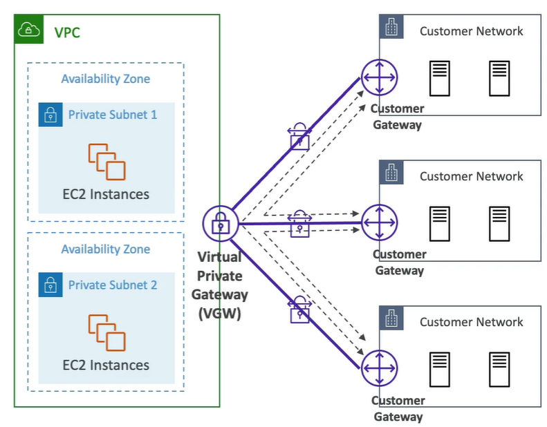

# AWS Networking Overview

- [AWS Networking Overview](#aws-networking-overview)
  - [Classless Inter-Domain Routing (CIDR)](#classless-inter-domain-routing-cidr)
    - [Overview](#overview)
    - [IPv4](#ipv4)
    - [Private vs Public IP (IPv4)](#private-vs-public-ip-ipv4)
      - [Public IP](#public-ip)
      - [Private IP](#private-ip)
      - [Private and Public IP Address Range](#private-and-public-ip-address-range)
  - [Virtual Private Cloud (VPC) \& Subnet](#virtual-private-cloud-vpc--subnet)
    - [VPC CIDR vs Subnet CIDR](#vpc-cidr-vs-subnet-cidr)
  - [Internet Gateway (IGW)](#internet-gateway-igw)
  - [Bastion Host](#bastion-host)
  - [Network Address Translation (NAT)](#network-address-translation-nat)
    - [A Brief History of NAT](#a-brief-history-of-nat)
    - [NAT Instance](#nat-instance)
    - [NAT Gateway](#nat-gateway)
  - [Network Control Access List (NACL)](#network-control-access-list-nacl)
      - [Ephemeral Ports](#ephemeral-ports)
  - [VPC Peering](#vpc-peering)
  - [VPC Endpoints](#vpc-endpoints)
    - [Overview](#overview-1)
    - [Types of VPC Endpoints](#types-of-vpc-endpoints)
  - [VPC Flow Logs](#vpc-flow-logs)
  - [AWS Site-to-Site VPN](#aws-site-to-site-vpn)
    - [How does VPN Work?](#how-does-vpn-work)
    - [AWS VPN](#aws-vpn)
  - [Direct Connect (DX)](#direct-connect-dx)
  - [Transit Gateway](#transit-gateway)
    - [Usecase 1: Increase Bandwidth of Site-to-Site VPN via ECMP](#usecase-1-increase-bandwidth-of-site-to-site-vpn-via-ecmp)
    - [Usecase 2: Share Direct Connect between Multiple AWS Accounts](#usecase-2-share-direct-connect-between-multiple-aws-accounts)
  - [VPC Traffic Monitoring](#vpc-traffic-monitoring)
  - [IPv6 for VPC](#ipv6-for-vpc)
  - [Egress-Only Internet Gateway](#egress-only-internet-gateway)
  - [AWS Network Firewall](#aws-network-firewall)
  - [Networking Cost](#networking-cost)

## Classless Inter-Domain Routing (CIDR)
### Overview
- CIDR is a method of  <ins>**allocating IP addresses** </ins>
- A CIDR consists of 2 components:
  - **Base IP**: e.g 192.168.0.0 (dotted-decimal notation)
  - **Subnet Mask**: defines how many <ins>**bits**</ins> can change in the IP
### IPv4
- An IP address is an idenfifier of a device on the network for communication purposes
- 8-bit number: 11000000 == 192
- Base IP consists of 4 number in 8-bit binary form (32 bit): 11000000.10101000.00000000.00000000
- Subnet mask (e.g /8) means the first 8 bits are constant, and the remaining can vary
- Each 8-bit is 1 byte, which is also an ***octet***
- 
- |Subnet Mask|No. of Avail. IP| Avail. IP Range |
  |-|-|-|
  |192.168.0.0/32|20 = 1 |192.168.0.0|
  |192.168.0.0/31|21 = 2 |192.168.0.0 - 192.168.0.1|
  |192.168.0.0/30|22 = 4 |192.168.0.0 - 192.168.0.3|
  |192.168.0.0/28|24 = 16 |192.168.0.0 - 192.168.0.15|
  |192.168.0.0/24|28 = 256 |192.168.0.0 - 192.168.0.255|
  |192.168.0.0/16|216 = 65,536 |192.168.0.0 - 192.168.255.255|
  |192.168.0.0/8|224 = 	16,777,216 |192.168.0.0 - 192.255.255.255|
- Use https://www.ipaddressguide.com/cidr.aspx to calculate

### Private vs Public IP (IPv4)
#### Public IP
- Unique globally
- Over 4 billion IPv4 addresses
- Not enough today because the size of internet was underestimated
- Assigned by Internet Service Provider (ISP)

#### Private IP
- Solves the issue of insufficient public IP
- Assgined by router/Dynamic Host Configuration Protocol (DHCP)
- Not registered on the internet/cannot access the internet
- Must be translated into public IP to access the internet
- Network Address Transaltion (NAT) is used to translate private to public and public to private IP addresses

#### Private and Public IP Address Range
- The Internet Assigned Numbers Authority (IANA) sets the public & private blocks of IPv4 addresses
- Private IPs:
  - **Class A**: 10.0.0.0 to 10.255.255.255 (10.0.0.0/8, for large networks)
  - **Class B**: 172.16.0.0 to 172.31.255.255 (for medium networks, AWS default VPC is in this range)
  - **Class C**: 192.168.0.0 to 192.168.255.255 (for small networks liek home network)
- Public IPs: all the remaining IPs

## Virtual Private Cloud (VPC) & Subnet
- Max 5 VPCs per region (soft limit)
- Max 5 CIDR per VPC (min /28, max /16)
- VPC CIDR should <ins>**NOT**</ins> overlap with other VPC/networks
  - if the VPCs/network were to connect together, CIDR cannot overlap
- AWS reserves **5 IP addresses** in each subnet (first 4 and last 1) which cannot be used. Using 10.0.0.0/24 as e.g:
  - 10.0.0.0 - Network Address
  - 10.0.0.1 - reserved for VPC router
  - 10.0.0.2 - reserved for mapping to Amazon-provided DNS
  - 10.0.0.3 - reserved for future use
  - 10.0.0.255 - Network Broadcast Address
- Generally, public subnet doesn't need as many IP addresses as private subnet

### VPC CIDR vs Subnet CIDR
- CIDR is a way of  **allocating** IP address range
- Therefore, the CIDR of subnet must be within the range of it's VPC
- Each subnet should have different CIDR range

## Internet Gateway (IGW)
- Allows resources in a VPC to connect to the internet
- Scales horizontally & highly redundant
- Only 1 IGW for 1 VPC
- Must be defined together with route tables for internet access

## Bastion Host
- Using IGW, an EC2 can access internet from a public subnet. What about private subnet?
- A secure way of accessing EC2 in private subnets without internet access
- The EC2's security group only allows for traffic from the bastion host EC2 via private IP

## Network Address Translation (NAT)
### A Brief History of NAT
Network Address Translation (NAT) is a technology that has, in a small way, revolutionized Internet communications. NAT allows multiple computers on a LAN to share a single public IP address for accessing the Internet. Without it, the IPv4 protocol's limited number of available addresses would be pushed to its limits. AT also provides some measure of "cloaking" of internal computers, since they are "hidden" from external (Internet) computers that can only "see" the NAT device through which they connect.

In the context of AWS, NAT is used for services that somewhat provides public IP address - in other words, allowing public access.

### NAT Instance
- Using Bastion Host, we can access private EC2 but it still cannot access the internet
- NAT = Network Address Translation
- It is an EC2 in public subnet with internet access
- The private EC2 access the internet via the NAT instance
- The NAT instance translates the source and destination IP address, hence must have Elastic IP attached and disabled "Source/destination check"
- Route tables must be configured to route traffic from private subnets to the NAT instance

### NAT Gateway
- Managed version of NAT instance
- Highly available within AZ (create in another AZ for cross-AZ HA)
- Cost charged by hour & amount of data transferred
- It uses an Elastic IP, must work together with an IGW
- **EC2 in a private subnet can connect to services outside VPC but external services cannot initiate a connection with those instances**

## Network Control Access List (NACL)

- Security Group is **stateful**, NACL is **stateless**
- NACLs are like firewall, controls traffic to-and-fro from subnets (1 NACL per subnet)
- Rules (1 - 32766) with higher precedence with lower number
- First match (Not like IAM where deny takes precedence)
- Recommended to increment rules by 100
- Great for controlling traffic at **subnet level**
- Default NACL acceps everything inbound/outbound

#### Ephemeral Ports

- For any 2 endpoints to establish a connection, **ports** must be used
- Client connect to a defined port, and expect a response onan ephemeral port
- Random port assigned just to establish connection
- Examples:
  - IANA & Windows 10: 49152 - 65535
  - Many Linux Kernels: 32768 - 60999

## VPC Peering
- Privately connect 2 VPCs using AWS network (works for VPCs in different region/account)
- Make these 2 VPCs behave **as if** they are in the same network
- Must not have overlapping CIDRs
- Not transitive: must establish connection for each VPC

## VPC Endpoints
### Overview
- Access AWS services not via public internet, but via private AWS network
- **Every** AWS service is publicly exposed
- VPC endpoints use AWS PrivateLink to connect to AWS services
- Redudant and scale horizontally
- Simplies the network infrastructure by removing IGW/NATGW
### Types of VPC Endpoints

Interface endpoints:
- Powered by PrivateLink
- Provisions an ENI as an entry point, must attach a Security Group
- Supports most AWS services
- $ per hour + $ per GB of data processed
Gateway Endpoints
- Must be used as a target in route table (no need Security Group)
- Supports S3 & DynamoDB
- Free

## VPC Flow Logs
- Captures IP traffic for interfaces:
  - VPC flow logs
  - Subnet flow logs
  - ENI flow logs

VPC Flow Log Syntax

## AWS Site-to-Site VPN
### How does VPN Work?

- VPN acts as tunnel which data travels through from source to destination
- It is encrypted such that outside cannot see the data inside the tunnel
- Data from client side is encrypted, then passes throught the VPN tunnel which others cannot access
- Before data goes into the VPN tunnel, data is first sent to ISP; however, because the data is encrypted, ISP cannot figure out what it's trying to access
- ISP forwards the request to VPN server, which then sends the request to the desired IP address

### AWS VPN
- Virtual Private Gateway (VGW)
  - VPN concentrator on the AWS side oif the VPN connection
  - Created and attached to VPC
  - Possible to customer Autonomous System Number (ASN)
- Customer Gateway (CGW)
  - Software/physical device on the customer side of the VPN connection
  - CGW Device (on-poremise)
    - Use public internet-routable IP address or
    - If the device is behind a NAT device enabled for NAT-T, use public address of the NAT device
- Enable Route Propogation for the Virtual Private Gateway in the route table associated with the subnets
- Add ICMP protocols on the inbound of Security Group if on-premise needs to ping the EC2

- AWS VPN CloudHub
  - Provides secure communication between multiple sites for multiple VPN connections
  - Low-cost hub-and-spoke model for primary or secondary network connectivity between different locations only using VPN
  - On-premise locations can communicate with each other via the VPN connection (via public internet)
  - To set it up, connect multiple VPN connections on the same VGW, set up dynamic routing  and configure route tables

## Direct Connect (DX)
- Provides a dedicated private connection from remote network to VPC
- Need to set up VGW on the VPC
- Access public and private resources on the same connection (doesn't go through the internet)
- Benefits:
  - Increase bandwidth throughput - lower cost for larger dataset
  - More consistent network performance
  - Hybrid cloud

- Direct Connect Gateway
  - DX for multiple VPC in many different regions (same account)

- Connection types:
  - Dedicated (1/10/100 Gbps): physical ethernet port dedicated
  - Hosted (50/500 Mbps - 10 Gbps): capacity can be added/removed on demand
  - Takes more than 1 month to set up with with AWS Direct Connect partners
- Encryption
  - Not encrypted in-transit but it's a private connection
  - Can add VPN for additional security
  

- Resilience
  

- To provide HADR for connection:
  - Set up a backup Direct Connect, which is very expensive
  - Use site-to-site VPN connection as a backup

## Transit Gateway
- Remember that VPC Peering is not transitive, which means network topology can get very complicated
- Transit Gateway allows for hub-and-spoke peering of thousands of VPC
- Regional resource, can work cross-region
- Share cross-account using Resource Access Manager(RAM)
- Can peer transit gateway across regions
- Use route tables to control which VPC can talk to which VPC
- Works with Direct Connect Gateway, VPN connectons
- Support IP Mulicase (no other AWS service supports this)

### Usecase 1: Increase Bandwidth of Site-to-Site VPN via ECMP
- ECMP: Equal Cost Multi-Path Routing
- Routing strategy to forward a packet over multiple best path
- Increase bandwidth of site connection to AWS
- By using ECMP, more tunnels are added and hence increase the throughput
- e.g 1 tunnel is 1.25 Gbps, 2.5 Gbps for 1 ECMP which has 2 tunnels

### Usecase 2: Share Direct Connect between Multiple AWS Accounts

## VPC Traffic Monitoring
- Allows to capture and inspect network traffic and route the traffic to security appliances
- Captures traffic from ENIS to ENI or network load balancer
- Capure all packets
- Source and target need to be in the same VPC or VPC Peered
- Good for threat inspection/monitoring/analysis

## IPv6 for VPC
- IPv4 limits to 4.3 billion IP addresses, not enough
- 3.4 x 1038 IPv6 addresses, each is public and internet-routable (no private range)
- x.x.x.x.x.x.x.x (x is hexadecimal)
- IPv4 cannot be disabled for VPC, only can dual-stack

## Egress-Only Internet Gateway
- Similar to NAT Gateway but for IPv6
- Allows EC2 instance to initiate connection with the internet, but not allow internet to initiate connection with the instance
- Must update route table

## AWS Network Firewall
- Protect entire VPC from layer 3 to layer 7
- Inspect any inbound or outbound traffic
- Internally, it uses AWS Gateway Load Balancer
- Centrally manage rules in AWS Firewall Manager
- Supportes many rules:
  - IP & port
  - Protocol
  - Stateful domain list rule group e.g only allow traffix to *.mycorp.com

## Networking Cost
- Use private IP instead of public IP to save money and better performance
- Ingress traffix is typically free, but egress traffic is not
- Try to keep traffic within AWS (use endpoints, bring compute to AWS)

