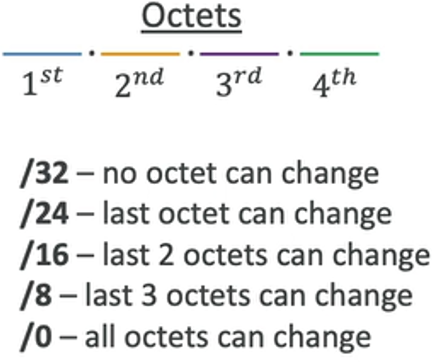

# AWS Networking Overview

- [AWS Networking Overview](#aws-networking-overview)
  - [Classless Inter-Domain Routing (CIDR)](#classless-inter-domain-routing-cidr)
    - [Overview](#overview)
    - [IPv4](#ipv4)
    - [Private vs Public IP (IPv4)](#private-vs-public-ip-ipv4)
      - [Public IP](#public-ip)
      - [Private IP](#private-ip)
      - [Private and Public IP Address Range](#private-and-public-ip-address-range)
  - [Virtual Private Cloud (VPC) \& Subnet](#virtual-private-cloud-vpc--subnet)
    - [VPC CIDR vs Subnet CIDR](#vpc-cidr-vs-subnet-cidr)
  - [Internet Gateway (IGW)](#internet-gateway-igw)
  - [Bastion Host](#bastion-host)
  - [NAT Instance](#nat-instance)
  - [NAT Gateway](#nat-gateway)
    - [Network Control Access List (NACL)](#network-control-access-list-nacl)
      - [Ephemeral Ports](#ephemeral-ports)

## Classless Inter-Domain Routing (CIDR)
### Overview
- CIDR is a method of  <ins>**allocating IP addresses** </ins>
- A CIDR consists of 2 components:
  - **Base IP**: e.g 192.168.0.0 (dotted-decimal notation)
  - **Subnet Mask**: defines how many <ins>**bits**</ins> can change in the IP
### IPv4
- An IP address is an idenfifier of a device on the network for communication purposes
- 8-bit number: 11000000 == 192
- Base IP consists of 4 number in 8-bit binary form (32 bit): 11000000.10101000.00000000.00000000
- Subnet mask (e.g /8) means the first 8 bits are constant, and the remaining can vary
- Each 8-bit is 1 byte, which is also an ***octet***
- 
- |Subnet Mask|No. of Avail. IP| Avail. IP Range |
  |-|-|-|
  |192.168.0.0/32|20 = 1 |192.168.0.0|
  |192.168.0.0/31|21 = 2 |192.168.0.0 - 192.168.0.1|
  |192.168.0.0/30|22 = 4 |192.168.0.0 - 192.168.0.3|
  |192.168.0.0/28|24 = 16 |192.168.0.0 - 192.168.0.15|
  |192.168.0.0/24|28 = 256 |192.168.0.0 - 192.168.0.255|
  |192.168.0.0/16|216 = 65,536 |192.168.0.0 - 192.168.255.255|
  |192.168.0.0/8|224 = 	16,777,216 |192.168.0.0 - 192.255.255.255|
- Use https://www.ipaddressguide.com/cidr.aspx to calculate

### Private vs Public IP (IPv4)
#### Public IP
- Unique globally
- Over 4 billion IPv4 addresses
- Not enough today because the size of internet was underestimated
- Assigned by Internet Service Provider (ISP)

#### Private IP
- Solves the issue of insufficient public IP
- Assgined by router/Dynamic Host Configuration Protocol (DHCP)
- Not registered on the internet/cannot access the internet
- Must be translated into public IP to access the internet
- Network Address Transaltion (NAT) is used to translate private to public and public to private IP addresses

#### Private and Public IP Address Range
- The Internet Assigned Numbers Authority (IANA) sets the public & private blocks of IPv4 addresses
- Private IPs:
  - **Class A**: 10.0.0.0 to 10.255.255.255 (10.0.0.0/8, for large networks)
  - **Class B**: 172.16.0.0 to 172.31.255.255 (for medium networks, AWS default VPC is in this range)
  - **Class C**: 192.168.0.0 to 192.168.255.255 (for small networks liek home network)
- Public IPs: all the remaining IPs

## Virtual Private Cloud (VPC) & Subnet
- Max 5 VPCs per region (soft limit)
- Max 5 CIDR per VPC (min /28, max /16)
- VPC CIDR should <ins>**NOT**</ins> overlap with other VPC/networks
  - if the VPCs/network were to connect together, CIDR cannot overlap
- AWS reserves **5 IP addresses** in each subnet (first 4 and last 1) which cannot be used. Using 10.0.0.0/24 as e.g:
  - 10.0.0.0 - Network Address
  - 10.0.0.1 - reserved for VPC router
  - 10.0.0.2 - reserved for mapping to Amazon-provided DNS
  - 10.0.0.3 - reserved for future use
  - 10.0.0.255 - Network Broadcast Address
- Generally, public subnet doesn't need as many IP addresses as private subnet

### VPC CIDR vs Subnet CIDR
- CIDR is a way of  **allocating** IP address range
- Therefore, the CIDR of subnet must be within the range of it's VPC
- Each subnet should have different CIDR range

## Internet Gateway (IGW)
- Allows resources in a VPC to connect to the internet
- Scales horizontally & highly redundant
- Only 1 IGW for 1 VPC
- Must be defined together with route tables for internet access

## Bastion Host
- Using IGW, an EC2 can access internet from a public subnet. What about private subnet?
- A secure way of accessing EC2 in private subnets without internet access
- The EC2's security group only allows for traffic from the bastion host EC2 via private IP

## NAT Instance
- Using Bastion Host, we can access private EC2 but it still cannot access the internet
- NAT = Network Address Translation
- It is an EC2 in public subnet with internet access
- The private EC2 access the internet via the NAT instance
- The NAT instance translates the source and destination IP address, hence must have Elastic IP attached and disabled "Source/destination check"
- Route tables must be configured to route traffic from private subnets to the NAT instance

## NAT Gateway
- Managed version of NAT instance
- Highly available within AZ (create in another AZ for cross-AZ HA)
- Cost charged by hour & amount of data transferred
- It uses an Elastic IP, must work together with an IGW
- **EC2 in a private subnet can connect to services outside VPC but external services cannot initiate a connection with those instances**

### Network Control Access List (NACL)

- Security Group is **stateful**, NACL is **stateless**
- NACLs are like firewall, controls traffic to-and-fro from subnets (1 NACL per subnet)
- Rules (1 - 32766) with higher precedence with lower number
- First match (Not like IAM where deny takes precedence)
- Recommended to increment rules by 100
- Great for controlling traffic at **subnet level**
- Default NACL acceps everything inbound/outbound

#### Ephemeral Ports

- For any 2 endpoints to establish a connection, **ports** must be used
- Client connect to a defined port, and expect a response onan ephemeral port
- Random port assigned just to establish connection
- Examples:
  - IANA & Windows 10: 49152 - 65535
  - Many Linux Kernels: 32768 - 60999

